# Table of contents

<br><br><br>
# Definitions
---

## Docker
https://www.youtube.com/watch?v=u-YWtdbpEhQ&ab_channel=Telusko

# REST API
https://www.youtube.com/watch?v=7YcW25PHnAA&ab_channel=WebConcepts


## Horizontal Vs Vertical scaling
* ### Horzintal 
    * scales by adding more machines
* ### Vertical 
    * scales by adding more power (CPU, RAM) to an existing machine
<br>

## Modulus
  * ```Python
    # dividend fraction divisor = quotient
    7 / 3 = 2.3

    # dividend mod divisor = remainder
    7 mod 3 = 1

    # if dividend = divisor then mod = 0
    7 mod 7 = 0

    # if dividend < divisor then mod = dividend
    7 mod 14 = 7
    ```

<br>

## Statistically Typed Vs Dynamically typed
* ### Statically typed
    * Type checking at compile-time
    * E.g C, Java
* ### Dynamically typed
    * Type checking at runtime.
    * Prone to runtime errors
    * E.g Python, JavaScript
<br>

## Compliled Vs Interpreted Language
* 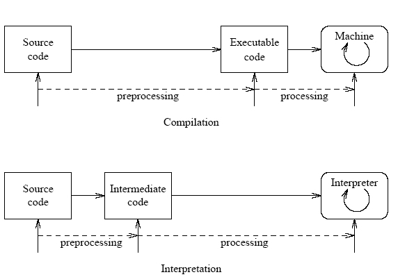

* Compiled Language
    * Peformance
* Interpreted Language
    * Portability

<br>

## Context Switch
* Process of storing the state of a process or thread, so that it can be stopped and another task resumed
* Can occur as a result of [interrupt](#interrupt), such as when another process needs to access disk storage etc..
* This allows multiple processes to share a single CPU

<br>

## Marshalling
* Process of converting the data into a byte-stream
* This conversion is achieved through [serialization](#serialization)
* UnMarshalling is the reverse process of Marshalling

<br>

## Buffer
* Temporary storage to hold data
* Use case:
    *   Reading/Writing one by o ne can be inefficient, especially if cost of these operation is high. OS Data Reading/Writing Subroutine is very expensive, instead of reading/writing one byte at time time we can read/write thousand of bytes at once to / from a temporary structure called buffer 

<br>

## Abstract Data Structure
* Describes behavior but not the implementation
* E.g Graph, List, Map, Priority Queue, Queue, Set, Stack, Tree

<br>

## Data Structure
* Concrete implementation of the abstract datatype e.g:
* E.g List -> Arraylist, Linkedlist, Map  -> Hashmap, Treemap

<br>

## Serialization
* Process of writing the state of an object into a byte stream
* Used wto transfer the object's state through network over store it on the disk
* Deserialization is the reverse process of Serialization

<br>

## String Interning
* Method to save the runtime memory by preserving a pool of immutable strings in a string intern pool
* Subsequent string creation, can just check this pool, if string already exists just return it from the pool instead of creating a new one
* Example of [flyweight-design-pattern](#flyweight-design-pattern)

<br>

## Recursive Algorithm
* All recursive algorithms can be implemented iteratively, although they may be more complex
* Space complexity will be at least O(n) where n is the depth of the recursive call

<br>

## Log Base
* Logs in computer science implicitly imply base 2 (whereas in math it's base 10)


<br><br><br>
# Arrays and Strings
---
<br>

\* Ordered<br>
\* Sequentially stored in memory<br>
\* Arrays and string questions are often interchangeable<br>
\* Can be either static or dynamic in size<br>
 
<br>


## Dynamic Array 
* When array is full, create a new array with double the size of the original one (resizing factor can vary), and copy all the elements to the new array

<br>

* ### String Concation
    * Strings are usually immutable which can result in a major performance bottleneck during repepetitive concat operation
    * Consider the following, a list of string in which all strings are same length (l) and there are n strings. <br><br>
        * ```Python
          sentence = "
          for s in strings:
               sentence.append(s)
           ```

        * On each concat a new string object needs to be created in memory and two strings must be copied over character by character. In first iteration we copy l characters, on second 2l, third 3l and so on... O(l + 2l + 3l .. nl) which reduces to O(ln<sub>2</sub>) because 1 + 2 + ... n = n(n+1)/2  or O(n<sup>2</sup>) + the l prefix
        <br>
        * To prevent this concat bottleneck whenever we manipulate strings many times, we should use a language specific tool for the job, such as a [dynamic array](#dynamic-Array) of the strings, which initially allocates space that is hoped to be larger than the final string and appends the strings to this array as necessary without a need to create a new string object on each subsequent manipulation

<br>
    
## Time Complexity
*   |Operation|Complexity|Comment|
    |:---:|:---:|:---|
    |access |O(1)| if items are consecutively stored in memory and each takes fixed  space, we can just multiply the initial memory by let's say 5 to access the 5th element of the array e.g cars[5]
    |insert |O(n) / O(1)| if array is full we need to create a new array and copy all the items to it which takes O(n) but happens so rarely that it can be said that the it's [amortized](#amortized) insertion time is O(1) <br><br> why copy all items into the array is O(n) ? well final capacity increase is n/2, previous capacity increase n/4 ... second capacity increase 2 elements to copy, first capacity increase 1 element to copy therefore the total number of insertion is 1/2 + 1/4 + 1/8 ... + 2 + 1 which is equal to just less than N
    |remove |O(n) / O(1)| we might have to shift n elements to transform the array back to the consecutive form, but if removed from the end can be O(1) 
    |search |O(n)| need to scan the entire array |

<br><br><br>
# Hash tables
---
<br>

\* Maps keys to vals e.g dict in python <br>
\* Unordered <br>

<br>

## Implementation (Collision Chaining) 

* ### Insert key val
    1. Compute the hash code from the key (hash code will be int usually)
        hash = hashfunc(key)
    1. Compute the index from the hash code (as len(array) can be smaller than the potentional hash codes
        index = hash % len(array)
    1. Store the (key,val) into the calculated index, as node in linked list

<br>

* ### Access key val
    1. Compute the hash code from the key (hash code will be int usually)
        hash = hashfunc(key)
    1. Compute the index from the hash code (as len(array) can be smaller than the potentional hash codes
        index = hash % len(array)
    1. Search through the linked list for the node.val == key to find the correspnding (key,val) and retreive the value

<br>

## Good hash function
* Should be deterministic (every time we pass the exact same data into the func, we should always get the same hash code out)
* Should uniformly distribute data (to avoid collisions)

<br>

## Perfect hash function
* If we know the data in advance, we could theoretically come up with a perfect hash func to use all the available space in the array

<br>

## Colisions:
* If two different keys are run through the hash func and return the same hash code 

<br>

## Resolving colissions:

* ### Increase the capacity
    * Fuller the array, the higher chance of collision
    * Load factor = total number of items stored / size of the array
    * If hash table is implemented as a resizable data structure, we can resize the hash table automatically when the load factor reaches a certain trashold e.g 70%

<br>

* ### Linear probing (open addressing)
    * Run linear search to find the next consecutive vacant slot
    * Efficient if load factory is low
    * Can cause primary clustering - keys might bunch together in the array, while large portions of it can end up unoccupied
        * Fix by using quadratic probing or double hashing

<br>

* ### Quadratic probing (open addressing)
    * (Failed attemps)<sup>2</sup>, when deciding how far from the original point of colission to look next, with each failed attempt, the distance grows rapidly 

<br>

* ### Double hashing (open addressing)
    * Double hashing - applies 2nd hash to the key when the collision occurs, the result gives number of position from the original collision to try next 

<br>

* ### Chaining (close addressing)
    * Chaining items that colided into a linked list

<br>

## Time Complexity
*   |Operation|Complexity|Comment|
    |:---:|:---:|:---|
    |access, insert, remove, search |O(1)| assuming a good hash func, with minimal collisions|

<br>

## Implementation (Using Chaining)
* ```Python
  # https://github.com/stephengrice/education/blob/master/HashTable/hashtable.py
  # Capacity for internal array
  INITIAL_CAPACITY = 50


  class Node:
      def __init__(self, key, value):
          self.key = key
          self.value = value
          self.next = None


  class HashTable:
      def __init__(self):
          self.capacity = INITIAL_CAPACITY
          self.size = 0
          self.buckets = [None]*self.capacity


      def hash(self, key):
          hashsum = 0

          for i, c in enumerate(key):
              hashsum += (i + len(key)) ** ord(c)
              hashsum = hashsum % self.capacity
          return hashsum


      def insert(self, key, value):
          self.size += 1
          index = self.hash(key)
          node = self.buckets[index]
          if node is None:
              self.buckets[index] = Node(key, value)
              return

          # 4. Iterate to the end of the linked list at provided index
          prev = node
          while node is not None:
              prev = node
              node = node.next

          # Add a new node at the end of the list with provided key/value
          prev.next = Node(key, value)


      def find(self, key):
          index = self.hash(key)
          node = self.buckets[index]

          while node is not None and node.key != key:
              node = node.next
          if node is None:
              return None
          else:
              return node.value


      def remove(self, key):
          index = self.hash(key)
          node = self.buckets[index]

          # 2. Iterate to the requested node
          prev = None
          while node is not None and node.key != key:
              prev = node
              node = node.next

          # Now, node is either the requested node or none
          if node is None:
              return None
          else:
              self.size -= 1
              result = node.value

              # Delete this element in linked list
              if prev is None:
                  self.buckets[index] = node.next
              else:
                  prev.next = prev.next.next
              return result
    ```

<br><br><br>
# Linked List
---
<br>

## Singly linked list
* Each node points to the next node <br><br>
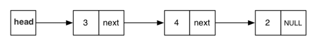

<br>

## Doubly linked list
* Each node poitns to the previous and next node <br><br>
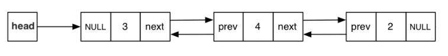

<br>

## Time complexity
*   |Operation|Complexity|Comment|
    |:---:|:---:|:---|
    |access|O(n)|as we need to traverse through n number of nodes|
    |search|O(n)|as we need to traverse through n number of nodes|
    |insert|O(1)|only when inserting to the start or the end of the linked list, otherwise search has to be used|
    |delete|O(1)|only when deleting at the start or the end of the linked list, otherwise search has to be used|

<br>

## Implementation
*   ```Python
    class Node:
        def __init__(self, val):
            self.next = None
            self.val = val


    class LinkedList:
        head = None

        def __init__(self, nodes):
            for node in nodes:
                self.append(node)


        def __str__(self):
            if self.head == None:
                return

            vals = []

            current = self.head
            while current != None:
                vals.append(current.val)
                current = current.next

            return str(vals)


        def prepend(self, val):
            if self.head == None:
                return

            new_head = Node(val)
            new_head.next = self.head
            self.head = new_head


        def append(self, val):
            if self.head == None:
                self.head = Node(val)
                return

            current = self.head
            while current.next != None:
                current = current.next

            new_node = Node(val)
            current.next = new_node


        def remove(self, val):
            if self.head == None:
                return

            if self.head.val == val:
                self.head = self.head.next

            current = self.head
            while current.next != None:
                if current.next.val == val:
                    current.next = current.next.next
                    return
                current = current.next
    ```


<br><br><br>
# Stack
---
<br>

\* [ADT](#Abstract-Data-Structure), can be implemented using [linked_list](#Linked-List)<br>
\* Items are added & removed from the same side (last-in first-out, imagine stack of dinner plates)<br>

<br>

## Usage
* To implement a recursive algorithm iteratively
* When need to backtrack(e.g if recursive check failed)

<br>

## Implementation

*  ```Python
    class Node:
        def __init__(self, val, last_min):
            self.next = None
            self.val = val


    class Stack:
        top = None

        def __init__(self, nodes):
            for node in nodes:
                self.push(node)


        def __str__(self):
            return str(self.top.val)


        def push(self, val):
            new_node = Node(val)
            new_node.next = self.top
            self.top = new_node


        def pop(self):
            if self.top == None:
                raise Exception("Stack is Empty")

            tmp_top = self.top
            self.top = self.top.next
            return tmp_top


        def peek(self):
            if self.top == None:
                raise Exception("Stack is Empty")

            return self.top.val


        def is_empty(self):
            return self.top == None
    ```

<br><br><br>
# Queue
---
<br>

\* [ADT](#Abstract-Data-Structure), can be implemented using [linked list](#Linked-List)<br>
\* Items are added and removed from the opposite side<br>

<br>

## Usage
* Cache

<br>

## Implementation
*   ```Python
    class Node:
        def __init__(self, val):
            self.next = None
            self.val = val


    class Queue:
        first = None
        last = None

        def __init__(self, nodes):
            for node in nodes:
                self.add(node)


        def __str__(self):
            return str((self.first.val, self.last.val))


        def add(self, val):
            node = Node(val)

            if self.last != None:
                self.last.next = node

            self.last = node

            if self.first == None:
                self.first = self.last


        def remove(self):
            if self.first == None:
                raise Exception("Queue is Empty")
            if self.first.next == None:
                self.last = None

            val = self.first.val
            self.first = self.first.next

            return val


        def peek(self):
            if self.first == None:
                raise Exception("Queue is Empty")

            return self.first.val


        def is_empty(self):
            return self.first == None
    ```

<br><br><br>
# Graphs
---
<br>

## Definitions:
*   |  |  |
    | :--- | :--- |
    | n | Number of nodes|
    | m | Number of edges |
    | Directed | Edge are one way → |
    | Undirected | Edges are two way ⟷ or simply － |
    | Connected | Associated with undirected graphs, there is a path between every two nodes  |
    | Strongly connected | Associated with directed graphs, there is a path in each direction between every two nodes |
    | Sparse | Has few edges |
    | Dense | Has many edges or is a almost complete graph, in a complete graph you have n(n-1)/2 edges
    | Cyclic | Cycles |
    | Acyclic | No Cycles |
    <br>

    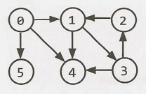

<br>

## Programming Representation
*  ```Python
    adjacency_list = {  0: [1, 4, 5],
                        1: [3, 4],
                        2: [1],
                        3: [2, 4],
                        4: [],
                        5: []
                     }

    adjacency_matrix =[ [0,1,0,0,1,1],
                        [0,0,0,1,1,0],
                        [0,1,0,0,0,0],
                        [0,0,1,0,1,0],
                        [0,0,0,0,0,0],
                        [0,0,0,0,0,0], ]
    ```

<br>

## Adjacancy List:
* Use when graph is [sparse](#sparse)
* Generally more efficient than the [adjacancy matrix](#adjacancy-matrix)

<br>

* ### Time Complexity:
    *   |Operation|Complexity|Comment|
        |:---|:---:|:---|
        |checking if there is edge between two nodes| O(n) | checking if there is edge between 0 and 5, we have to loop through all the adjacent nodes in either 0 i.e [1,4,5] or 5 i.e [] and there can be n of these adjacent nodes

<br>

* ### Space Complexity:
    * |Structure|Complexity|Comment|
      |:---|:---:|:---|
      |undirected tree |O(n)| as undirected tree will have n - 1 edges we can write the complexity as O(n - n-1)|
      |directed complete with self loops|O(n<sup>2)|as when graph is complete it will have n(n-1) /2 edges or n<sup>2 |

<br>
    
## Adjacacny Matrix:
* Use when graph is [dense](#dense) (if the graph is sparse we would waste memory as most of the matrix cells would remain unused)
* In an undirected graph an adjacency matrix will be symmetric

<br>

* ### Time Complexity:
    *  |Operation|Complexity|Comment|
       |:---|:---:|:---|
       |checking if there is edge between two nodes| O(1) | as we can simply use O(1) array access adjacent_matrix[0][5] to check if the edge exists

<br>

* ### Space Complexity:
   *  |Structure|Complexity|Comment|
       |:---|:---:|:---|
       |undirected tree |O(n<sup>2</sup>)| as we have to allocate n * N matrix to the store node-connectivity |
       |directed complete with self loops|O(n<sup>2</sup>)|as we have to allocate n * N matrix to store the node-connectivity |

<br>

## Graph Search:
* ### DFS:
    * Uses [stack](#stack)
    * Explore each branch fully before moving on to the next branch (hence the name depth first)
    * Suitable if solution away from source, search the entire tree (such as solving maze), find strongly connected components of the graph
    * Uses less memory than bfs (depending on branching factor)
    * Might find suboptimal solution

    <br>

    * ```Python
      adjacency_list = { 0: [1, 4, 5],
                         1: [3, 4],
                         2: [1],
                         3: [2, 4],
                         4: [],
                         5: []
                       }

      visited = []

      def dfs(node):
          visited.append(node)
          for adjacent_node in adjacency_list[node]:
              if adjacent_node not in visited:
                  dfs(adjacent_node)
      dfs(0)
      ```
      <blockquote>
      [0, 1, 3, 2, 4, 5]
      </blockquote> <br>

    * #### Time Complexity:
        *  |Operation|Complexity|Comment|
           |:---|:---:|:---|
           |search | O(n + m) | because every edge is considered exactly twice, and every node is processed exactly once, so the complexity has to be a constant multiple of the number of edges as well as the number of nodes, which is equal to O(n + 2m), as Big O analysis ignores constant this becomes O(n + m)

    <br>

    * #### Space Complexity:
        * |Operation|Complexity|Comment|
          |:---|:---:|:---|
          |search |O(n)| as nodes are pushed and poped from the stack during the traversal, the most memory it can take up is the longest possible path to find the solution, as during that time all the nodes will be pushed on the stack |

* ### BFS:
    * Uses [queue](#queue)
    * Explore the neighbors before going on to any of their children (hence breadth first)
    * Suitable if solution close to source, find shortest path, test if graph is bipartite
    uses more memory than dfs (depending on braching factor)
    * Complete algorithm, meaning if used to search for solution in the lowest depth possible, it gives the optimal solution 

    <br>

    *   ```Python
        from collections import deque

        adjacency_list = { 0: [1, 4, 5],
                           1: [3, 4],
                           2: [1],
                           3: [2, 4],
                           4: [],
                           5: []
                         }

        def bfs(root):
            visited, queue = [root], deque([root])
            while queue:
                node = queue.popleft()

                for adjacent_node in adjacency_list[node]:
                    if adjacent_node not in visited:
                        visited.append(adjacent_node)
                        queue.append(adjacent_node)
            return visited

        print(bfs(0))


        def bfs_shortest_path(start, end):
            visited, queue = [start], deque([(start, [])])
            while queue:
                node, path = queue.popleft()           
                if node == end:
                    return path + [node]
                
                for adjacent_node in adjacency_list[node]:
                    if adjacent_node not in visited:
                        visited.append(adjacent_node)
                        queue.append((adjacent_node, path + [node]))
            return None

        print(bfs_shortest_path(0,2))


        def bfs_is_connected(start, end):
            visited, queue = [start], deque([start])
            while queue:
                node = queue.popleft()           
                if node == end:
                    return True
                
                for adjacent_node in adjacency_list[node]:
                    if adjacent_node not in visited:
                        visited.append(adjacent_node)
                        queue.append((adjacent_node))
            return False

        print(bfs_is_connected(0,2))
        ```
        <blockquote>
        [0, 1, 4, 5, 3, 2] <br>
        [0, 1, 3, 2] <br>
        True <br>
        </blockquote> <br>

    * #### Time Complexity:
        * |Operation|Complexity|Comment|
          |:---|:---:|:---|
          |search | O(n + m) | same as DFS |

    <br>

    * #### Space Complexity:
        * |Operation|Complexity|Comment|
          |:---|:---:|:---|
          |search|O(l)| where l is max number of nodes in a single level |

    <br>

    * 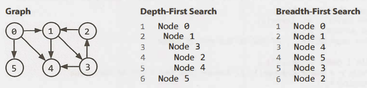

<br>

## Bidirectional Search: <br>
* Used to find the shortest path between a source and destination node, by running two simultaneous bfs searches one from each node. where their searches collide, we have found the shortest path <br><br>
* It's faster than a traditional bfs because given the source s to target t has distance d to find the target in the traditional bfs the worst case O(b<sup>d</sup>) whereas in bidirectional search the two searches collide after approximately levels, meaning the search from s visit approximately b<sup>d&frasl;2</sup> nodes, as does the search from target


<br><br><br>
# Trees
---
<br>

\* Connected acyclic undirected graph <br>
\* Each node has up to n children <br>
\* All nodes are reachable from a single node <br>
\* Given n nodes the undirected tree must have exactly n - 1 edges <br>

<br>

## Definitions:
*   |  |  |
    | :--- | :--- |
    | h    | Height of the tree
    | Root | Topmost, or the bottommost node (not from graph theory, defined for programming purposes) |
    | Leaf | Node with no children |

<br>

## Binary Tree
* Each node has up to two childrens

<br>

* ### Time Complexity:
    *  |Operation|Complexity|Comment|
       |:---|:---:|:---|
       |search, insert, delete | O(n) | where n is the number of nodes in the tree, as we need to traverse all the nodes before being able to perform search, insert, delete.>

<br>

## Binary Search Tree
* The left subtree of a node contains only nodes with keys less than the node's key
* The right subtree of a node contains only nodes with keys greater than the node's key
* Both the left and right subtrees must also be binary search trees <br><br>
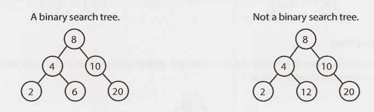

<br>

* ### Time Complexity:
    |Operation|Complexity|Comment|
    |:---|:---:|:---|
    |search, insert, delete | O(h) | as we can determine the path to the node which we want to perform the search,insert,delete operation by checking the magnitude of each node's value through the traversal to determine if we need to move to the left or right subtree

<br>

# Balanced Binary Tree
* The height of every node differ by no more than 1

<br>

## Complete Binary Tree
* Every level of the tree is fully filled, except for perhaps the last level. to the extent that the last level is filled ,it is filled left to right
* Complete binary tree is alway balanced but nothe other way around<br><br>
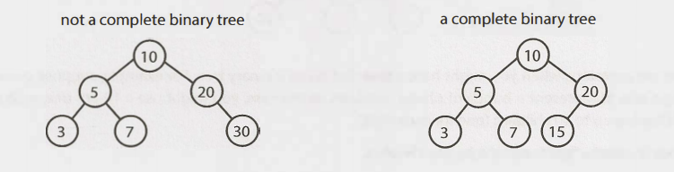

<br>

## Full Binary Tree
* Every node has either zero or two children, that is no node have only one child.
<br><br>
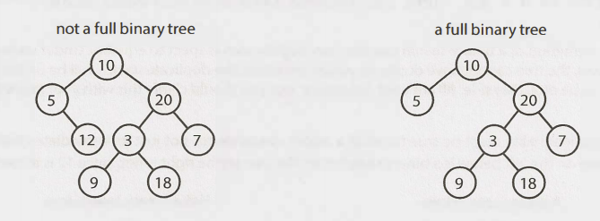

<br>

## Perfect Binary  Tree
* Is both complete and full, all leaf nodes will be at the same level, and this level has the maximum number of nodes.

* A perfect tree must have exactly 2<sup>h</sup> -1 nodes <br><br>
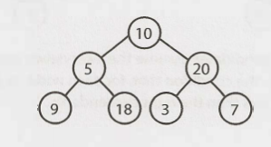

<br>

## Binary Tree Traversal
*  Process of visiting each node in a tree data structure, exactly once

<br>

* ### Notation
    |  |  |
    | :--- | :--- |
    | n |  visit(print) current node |
    | l |  visit(print) left branch  |
    | r |  visit(print) right branch |

<br>

* ### Pre-Order Traversal
    * Order of operations - nlr
    * The root is always the first node visited

<br>

* ### In-Order Traversal
    * Order of operations - lnr
    * When performed on binary search tree, it visits the nodes in the ascending order (hence the name in-order)

<br>

* ### Post-Order Traversal
    * Order of operations - lrn
    * The root is always the last node visited

<br>

  * ```Python
    class TreeNode:
        def __init__(self, val):
            self.left = None
            self.right = None
            self.val = val

        def __str__(self):
            return str(self.val)

    #fill in the tree
    node = TreeNode(10)

    node.left = TreeNode(7)
    node.right = TreeNode(11)


    node.left.left = TreeNode(6)
    node.left.right = TreeNode(8)
    node.right.right = TreeNode(20)

    node.left.left.left = TreeNode(1)
    node.left.right.right = TreeNode(9)
    node.right.right.left = TreeNode(14)
    node.right.right.right = TreeNode(22)

    visited = []

    def pre_order_traversal(node):
        if node != None:
            visited.append(node.val)
            pre_order_traversal(node.left)
            pre_order_traversal(node.right)

    pre_order_traversal(node)
    print(visited)

    visited = []

    def in_order_traversal(node):
        if node != None:
            in_order_traversal(node.left)
            visited.append(node.val)
            in_order_traversal(node.right)

    in_order_traversal(node)
    print(visited)

    visited = []

    def post_order_traversal(node):
        if node != None:
            post_order_traversal(node.left)
            post_order_traversal(node.right)
            visited.append(node.val)

    post_order_traversal(node)
    print(visited)
    ```
    <blockquote>
    [10, 7, 6, 1, 8, 9, 11, 20, 14, 22] <br>
    [1, 6, 7, 8, 9, 10, 11, 14, 20, 22] <br>
    [1, 6, 9, 8, 7, 14, 22, 20, 11, 10] <br>
    </blockquote>
    <br>
  * 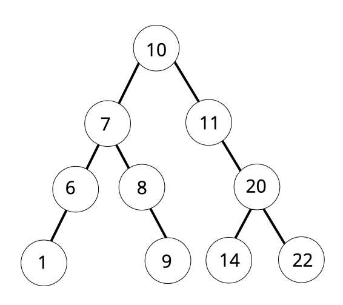
 >
 <br>

* ### Complexities 

    * #### Time:
        * |Operation|Complexity|Comment|
          |:---|:---:|:---|
          |traversal| O(n) |  since the number of edges that can originate from a node is limited to 2, the maximum number of total edges in a binary tree is n - 1 where n is total number of nodes, the time complexity becomes O(n + n-1) which is O(n)

    <br>

    * #### Space:
        * |Operation|Complexity|Comment|
          |:---|:---:|:---|
          |traversal | O(h) |since traversal means we need to visit each node in a tree data structure, and stack pushes and pops nodes as we traverse through the tree, the space complexity will equal the longest path we need to traverse, i.e the height of the tree as all nodes will be pushed to the stack at that point

<br>

## Binary Heap (min-heap and max-heap)
* A complete binary tree
* A binary heap is a common implementation of a heap (heap is an implementation of priority queue [ADT](#adt))
*  suitable for problems to find smallest of something or the largest of something

<br>

* ### Insert node into the heap
    * Let's say we want to insert 2

        1. insert at the bottom rightmost spot to maintain the complete tree property
        1. fix the tree by swapping the new node with its parent, until we find an appropriate spot for the node (essentially bubble up the minimum element) <br><br>
        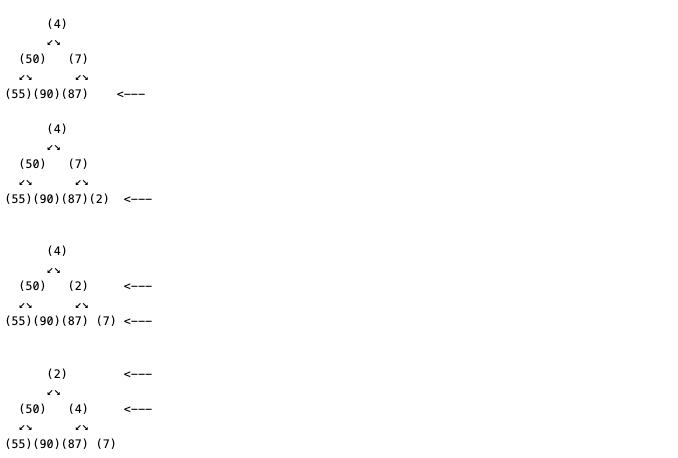

<br>

* ### Extract node from the heap
    * Let's say we want to extract 2

        1. extract the min node (the root element) and remove it
        1. swap the removed min node with the last element in the heap (the bottommostrightmost node). then we bubble down the element by swapping it with one of it's children until the min-heap property is restore
        <br><br>
        

<br><br>
* ### Time Complexity:
    *  |Operation|Complexity|Comment|
       |:---|:---:|:---|
       |Insert| O(log(n)) | because in worst case we need to do a traversal of the height of the tree, to insert or delete nodes, and since we know the tree is balanced (as all complete binary trees are) then we know that balanced tree height can be express as 1 + floor(log(n)) which after removing constant operations becomes O(log(n))
       |Extract| O(log(n)) | same as insert

<br>

## Tries
* Variant of tree (sometimess called a prefix tree) at which characters are stored at each node
* Commonly a trie is used to store the entire (English) language for quick prefix lookups. while a hash table can quickly look up wheather a string is a valid word, it cannot tell us if a string is a prefix of any valid words, a trie an do this very quickly.
* A path from root of the tree up to (*)  may represent a word or part of the word nodes usually store a character as its data
<br><br>
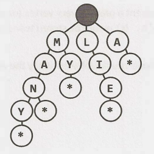
<br>

* The fact there is a * Node under many indicates that MANY is a complete word. the existence of the MA path indicates there are words that start with MA

<br>

* ### Time Complexity:
    *  |Operation|Complexity|Comment|
       |:---|:---:|:---|
       |search| O(l) | where l is the length of the string. this is actually the same runtime as hash table. although we often refer to has hash lookups as O(1) this isn't always true, a hash table must read through all the chars in the input O(l) times in the case of word lookup


<br><br><br>
# Design Patterns
---
<br>

## Creational
* Creating objects

<br>

## Structural
* Relationships between objects

<br>

## Behavioural
* Interactions between objects

<br><br><br>
# Object-Oriented Design
---
<br>

\* Requires to sketch out the classes and methods to implement technical problem using OOO Design<br>
\* Single Responsibility principle - every class should have a single responsibility<br>

<br>

## System Design

* ### Step 1: Handle Ambiguity
    * These technical problems are purposely ambigious, depending on a question one should clarify with "six Ws" *who, what, where, when, how, why* To resolve any ambigiouty about the problem raised

    * E.g design a coffee maker
    * Seems straightforward but in reality we need to know question such as; is it going to be used in massive restaurant chains servicing hundreds of customers per hour and makign ten different kinds of coffee products?, or a single machine, designed for eldery's people to to just make a simple black coffee now and then.

<br>

* ### Step 2: Define the core Objects
    * E.g for restaurant things like *Table, Guest, Party, Order, Meal, Employee, Server, Host*

<br>

* ### Step 3: Analyze Relationships
    * **Key Questions:** 
        1. Which objects are members of which other objects?
            * **Party** should have an array of **Guests**
        1. Do any objects inherit from any other?
            * **Server** and **Host** inherit from **Employee**
        1. Are relationships many-to-many or one-to-many, or one-to-one?
            * Each **Table** has one **Party** but each **Party** hay have mutliple **Tables**
            * There is one **Host** for the **Restaurant** <br> <br>
    * **Careful here**  one might have to return to [Step 1](#Step-1) to handle any ambiguity such as, can single table have multiple parties? (restaraunt which handles wedding)

<br>

* ### Step 4: Define the core Actions and how they relate to each other
    * E.g **Guest** requiests a **Table** from the **Host** the **Host** looks up the **Reservation** and if it exists assign the **Party** to a **Table**, Otherwise , the **Party** is added to the end of the list. When **Party** leaves, the **Table** is freed and assigned to a new **Party** in the list.

    * **Careful here** we don't have a **Party** object so we might have to go back to [Step 2](#Step-2)


<br><br><br>
# Object-Oriented Programming
---
<br>

\* Based on objects, promotes **modularity** and **reusability**<br>

<br>

## 4 Pinricples
* ### Encapsulation
    * Hiding data by restricting direct access
    * Access can be given using getter and setter methods
* ### Abstraction
    * Hiding implementation details by focusing on what object does rather than how it does it 
    * Applied using abstract class or interface
* ### Inheritance
    * Class Dog extends Animal
    * Reduces duplicate code

        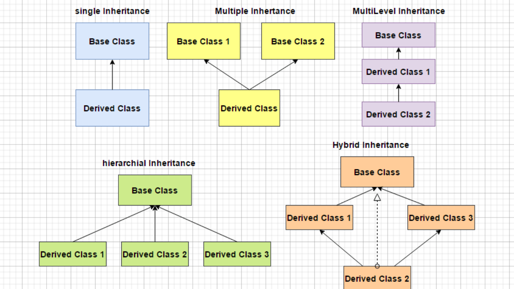
* ### Polymorphism (translated as many forms)
    * Ability to treat a class of an object as if it is the parent class
    * E.g Dog that inherits from Animal. Polymorphism is the ability to treat the dog as Animal

<br>

## Object-Oriented Programming vs Object-Based Programming
* ### Object-Oriented Programming:
    * Follow all 4 OOP principles
* ### Object-Based Programming
    * Do not follow all the OOP principes such as inheritance and polymorphism
    * Have built-in objects e.g window object in JavaScript

* Following all the 4 OOP pinrciples, doesn't make the language 100% Objet-oriented, e.g Java because it contains eight primitive data types, we cannot state it's fully Object-Oriented

<br>

## Association, Aggregation, Composition 

<br>

* **Association** - I have a relationship with an object. Foo uses Bar
    ```
    public class Foo { 
        void Baz(Bar bar) {
        } 
    };
    ```
<br>

* **Aggregation** (weak relationship) - I have an object which I've borrowed from someone else. When Foo dies, Bar may live on.
    ```
    public class Foo { 
        private Bar bar; 
        Foo(Bar bar) { 
        this.bar = bar; 
        }
    }
    ```

<br>

* **Composition** (strong relationship) - I own an object and I am responsible for its lifetime. When Foo dies, so does Bar
    ```
    public class Foo {
        private Bar bar = new Bar(); 
    }
    ```

    <br>

    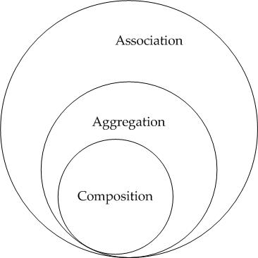


<br><br><br>
# Java Virtual Machine (JVM)
---
<br>

* ## Subsystem 1. Class Loader
    * ### Phase 1: Loading
        * Loads ```.class``` files into memory

        * #### Three built-in classloaders:
            * #### Bootstrap Class Loader
                * Loads ```.class``` files from rt.jar (a.k.a runtime jar)  which contains all class files of Java Standard Edition e.g java.lang etc...
            * #### Extension Class Loader
                * Child of Bootstrap Class Loader
                * Loads additional jar files located inside $JAVA_HOME/jre/lib/ext
            * #### System/Application Class Loader
                * Child of Extension Class Loader
                * Loads the class files from the classpath (our application class files) 
                * Classpath set to current dir by default, modifiable by -cp switch)
    <br><br>
    * ### Phase 2: Linking
        * #### Step 1: Verify
            * Bytecode class files are verified if they conform to standards 
        * #### Step 2: Prepare
            * Memory allocated for static variables and default values are assigned 
        * #### Step 3: Resolve
            * All [symbolic references](#symbolic-reference) are replaced with actual references
    <br><br>
    * ### Phase 3: Initilization
        * All static variables are assigned with the actual values
        * [Static blocks](#Static-block) are executed 
  <br><br><br>
* ## Subsystem 2. Runtime Data Area 
    <span style="color:Tomato">shared-to-all-threads</span> | <span style="color:MediumSeaGreen">per-threads</span> <br><br>

    * #### <span style="color:Tomato">Class(Method) Area</span>
        * Responsible for holding class level information such as [runtime constant pool](#runtime-constant-pool), static fields, static methods etc
    * #### <span style="color:Tomato">Heap</span>
        *  used to allocate memory to objects at run time
        *  slower allocation (compared to stack)
        *  no size limit
        *  allocated when new objects are created and deallocated by garbage collector when they are no longer referenced
    * #### <span style="color:MediumSeaGreen">Stack</span>
        *  used to store data and partial results which will be needed while returning value for methods or [dynamic linking](#dynamic-linking)
        *  each method invocation creates a new stack frame, subsequently each method invocation completion destroys the stack frame
        * Faster allocation (compared to heap)
        * Size limit (meaning size is usually smaller than heap)
        * Allocated when method is called and deallocated when method returns
    * #### <span style="color:MediumSeaGreen">Native Method Stack</span>
        *  contains all the native methods
    * #### <span style="color:MediumSeaGreen">Program Counter Register</span>
        *  contains the address if an instruction that JVM is currently executing
<br><br><br>
* ## Subsystem 3. Execution Engine
    * Converts bytecode to machine code and executes the instructions
    * Contains:
        * ### Interepreter
            * Reads and execute bytecode 
            * The problem with interepreter is that, when method is called multiple times, it interprets those lines of bytecode again and again
        * ### Just-In-Time (JIT) Compiler
            * Helps overcome the problem with the interpreter, when repeated method call occur, JIT compiles the bytecode to native code. This native code will be used directly for the repeated method calls
            * Components to achieve this feautre:
                * Intermediate code generator - generates intermediate code
                * Code optimizer - optimizes the intermediate code
                * Target code generator - converts intermediate code to native machine code
                * Profiler - it is responsible for finding the methods which are called repeatedly
        * ### [Garbage Collector](#garbage-collector)
        * ### Java native method interface
            * Make native libraries available for the execution engine
<br><br><br>
* ## JVM Shutdown
    * ### In controlled process
        * The last non-[daemon](#daemon-thread) terminates.
        * Interrupt signal from the OS (Ctrl + C)
        * System.exit()
        <br><br>
        * Subsequently
            * JVM Starts all the [Shutdown-hooks](#Shutdown-hook) in an unspecified order


    * ### Abruptly
        * Host OS dies
        * Kill signal from the OS (kill - 9 <jvm_pid>)
        * Runtime.getRuntime().halt()


<br><br><br>
# Class
---
<br>

* ## Runtime Class
    * Only one instance of ```Runtime class``` per java application
    * Used to interfact with java runtime environment e.g execute process, invoke GC etc...

* ## Singleton Class
    ```Java
    public class Singleton {
        private static Singleton singleton = new Singleton();

        // private Constructor prevents any other class from instantiating this class
        private Singleton() {}

        // static 'instance' method
        public static Singleton getInstance() {
            return singleton;
        }
    }

    Singleton singleton = Singleton.getInstance();
    ```
* ## Read-only
    * Mark all fields ```private```
    * Contains only getters methods
* ## Write-Only
    * Mark all fields ```private```
    * Contains only setter methods
* ## Immutable
    * Mark all fields ```final```
    * Mark ```class``` as ```final```

* ## Nesting    
    * ### Nested Class
        * A ```class``` which is declared inside another ```class``` or ```interface```

        * A ```class``` defined inside an ```interface``` is implicitly ```static```
    * ### Nested Interface
        * An ```interface``` which is declared inside another ```class``` or ```interface```
        <br><br>
        * Must be ```public``` if declared inside another ```interface```
        * Can have any [access specifier](#access-specifiers) if declared inside another ```class```
        <br><br>
        * An  ```interface``` declared inside an ```interface``` or ```class``` is implicitly ```static```
    <br><br>
    * Used to logically group classes & interfaces in one place
    * Can access all the members of it's outer class (including private members)
    <br><br>
    * Increase total number of classes used, which can result in additional workload for [JVM](#JVM), because if we don't instantiate the nested classes explicitly, they will still all be instantiated implcitly upon instantiating the outer class

    <br>

    * ### Static Nested Class
        *   ```Java
            package myapp;

            public class OuterClass {
                public static class StaticNestedClass {
                    
                }
            }
            ```
        * Declared as static member of another class
        * Can access only ```static``` members of it's ```OuterClass```
        * Doesn't require the ```OuterClass``` to be instantiated before it can be used
            <br>

            ```Java         
            OuterClass.StaticNestedClass nestedStaticObject = new OuterClass.StaticNestedClass();
            ```
        <br><br>
    * ### Non-Static Nested Class (Also known as Inner Classes)
        *   ```Java
            package myapp;

            public class OuterClass {
                public class InnerClass {
                    
                }
            }
            ```
        * Declared as an instance member of another class
        * Can access both ```static``` and ```non-static``` members of it's ```OuterClass```
        * Requires the ```OuterClass``` be instantiated before it can be instantied and used
            ```Java        
            OuterClass outerClass = new OuterClass();
            OuterClass.InnerClass innerObject = outerClass.new InnerClass();
            ```

        * ### Futher divided into:
            <br>

            * ### Local Inner Class
                ```Java
                public class A{  
                    private int val = 30; 
                    
                    void display(){  
                        class B{  
                            void msg(){System.out.println(val);}  
                        }
                            
                        B b = new B();  
                        b.msg();  
                    }  
                }

                A a = new A();  
                a.display();
                ```
                <blockquote>
                30
                </blockquote>
                <br>

                * Created within a method
                * Use when more than one instance is to be created

            <br>

            * ### Anonymous Inner Class
                ```Java
                abstract class A{  
                    abstract void display();  
                }  

                A a = new A(){  
                    void display(){System.out.println("abstract method display() implemented inside an Anynomous Inner Class");}  
                };

                a.display();
                ```
                * Synthactically convenient way of writing a local inner class as it is Anonymous (name will be decided by the java compiler)
                * Use when only single instance is to be created
                * Can be used to implement abstract method, intherface etc ...

<br><br><br>
# Object Class
---
<br>

## clone()
* By default creates a shallow copy


<br>

* ### Shallow Vs Deep clone <br><br>
* 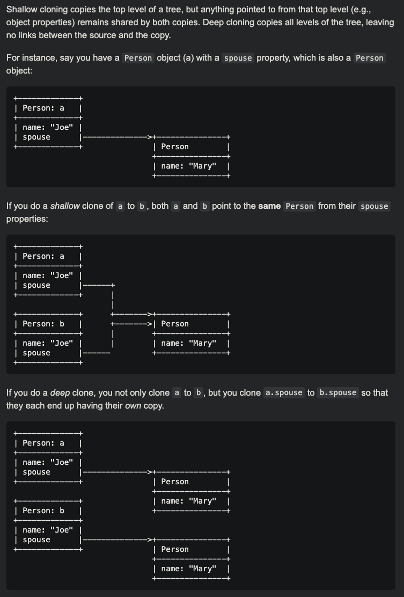

<br>

## hashcode()
* Return distinct ```int``` representation of the object memory address, should be unique for each instance
* Subsequent executions of the application will cause this ```int``` to change

<br>

## equals()
* By default checks if ```this == object```
* Needs to be overriden to check based on object's properties

    ```Java
    public boolean equals(Object object){
        if (this == object){
            return true;
        }
        if ( object == null){
            return false:
        }
        if ( object instanceof Student){
            Student student = (Student) object;
                if (student.name == this.name){
                    return true;
                }
        }
        return false;
    }
    ```

<br>

## Contract between hashcode() and equals()
* In Hashing Structures:
    * ```hashCode()``` is used to calculate the index to which we want to store / retreive (key, val) from
    * ```equal()``` is used to traverse through this index nodes to find wher` ```node.val.equals(key)``` and retrieve the val at this key

* Contract:
    * Not validaded by JVM, but can introduce runtime issues 

    * Equal **instances** always produce the same **hashCode**:
        * When we override ```equals()```, it’s necessary to override the ```hashCode()``` too so that their contract is not violated 
    * Equal **hashcodes** *do not* mean equal **instances**:
        * When we override ```hashcode()``` it's **not** necessary to override the ```equals()```<br><br>

* E.g, When planning to use the class as HashTable key:
    * Both ```equals()``` and ```hashCode()``` must be overriden, as by default equal instances do not produce the same hashcodes <br><br>
    * ```Java
        import java.util.Map;
        import java.util.HashMap;

        public class Test{
            public static void main(String args[]){

                //Contract Violation in Student Class

                Map<Student, Integer> hm = new HashMap<>();
                
                // Equal instances
                Student student1 = new Student(35,"Peter"); // hashCode = 43243243
                Student student2 = new Student(35,"Peter"); // hashCode = 63542592

                hm.put(student1, 2);
                System.out.println(hm.get(student2)); // results in null

                //Contract Patched in ModifiedStudent Class
                
                Map<ModifiedStudent, Integer> hm2 = new HashMap<>();

                // Equal instances
                ModifiedStudent modifiedStudent1 = new ModifiedStudent(35,"Peter"); // hashCode = 1085
                ModifiedStudent modifiedStudent2 = new ModifiedStudent(35,"Peter"); // hashCode = 1085

                hm2.put(modifiedStudent1, 3);
                System.out.println(hm2.get(modifiedStudent2)); // results in 3
            }
        }

        class Student{
            int id;
            String name;

            public Student(int id, String name){
                this.id = id;
                this.name = name;
            }


            public boolean equals(Student student){
                return this.id == student.id;
            }
        }


        class ModifiedStudent{
            int id;
            String name;

            public ModifiedStudent(int id, String name){
                this.id = id;
                this.name = name;
            }

            public int hashCode(){
                return 31 * this.id;
            }

            public boolean equals(Object object){
                ModifiedStudent modifiedStudent = (ModifiedStudent) object;
                return this.id == modifiedStudent.id;
            }
        ```
<br>

## toString()
* Java compiler interanally invokes toString() when trying to obtain the string representation of an object (e.g with print statement)


<br><br><br>
# Strings
---
<br>

* Are Immutable
    <br>

    ```Java
    String s="Apple";  
    s.concat(" Juice"); //concat() method appends the string at the end  
    System.out.println(s);
    ```
    <blockquote>
    Apple
    </blockquote>

<br>

* ## String Pool
    * JVM implementation of [string interning](cs.ipynb)
    * Strings in the string pool are java objects which is contrast to [constant pool](#constant-pool) where strings are seralized and not Java Objects 
    * Located in [heap](#heap)  <br><br>

* ## String Compairson
    ```string1 == string 2``` checks if the reference of the strings is the same. <br>
    ```string.equals(string2)``` checks if the content of the strings is the same <br><br>
    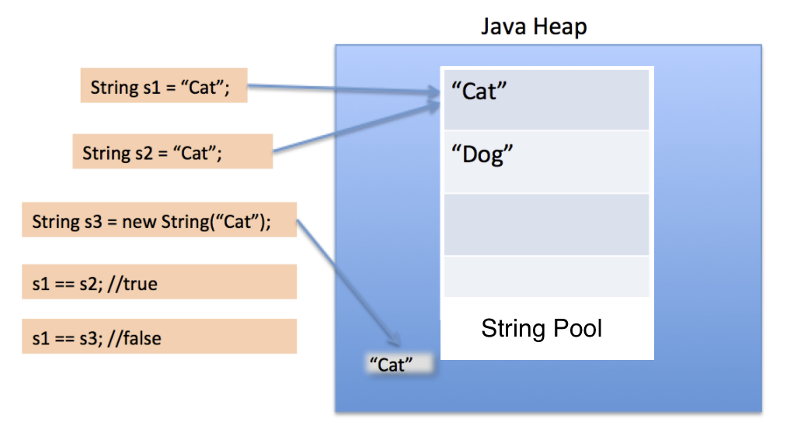
    <br><br>
   
    ```Java
    // 1. Checks if String literal already exists in the String Pool.
    // 2. Since it doesn't, creates new String literal object in the String Pool 
    // 3. Returns reference of the newly created object ing the String Pool
    String s1 = "Cat"
    
    // 1. Checks if String literal already exists in the String Pool.
    // 2. Since it exists, no need to create new String literal object
    // 3. returns the reference to the already existing String pool object
    String s2 = "Cat"
    
    // 1. Creates a new String object in heap memory
    // 2. Checks if String literal alread yexists in the String Pool
    // 3. If exists does nothing, If doesn' creates new string ltieral object and adds it to the the String Pool.
    // 4. Returns reference to the heap (non-pool) object
    String s3 = new String("Cat") 
    String s3 = new String("Dog") // Creates 2 Objects, 1 in heap, 1 in String Pool

    s1 == s2  // true
    s1 == s3  // false
    
    s3 =  s1.intern() // intern() return String object reference from String Pool
    s1 == s3  // false
    ```
    <br>
* ## StringBuilder Vs StringBuffer
    * Refer to [Dynamic Array string concat](#Dynamic-Array)
    <br><br>

        |StringBuilder|StrigBuffer|
        |:--:|:--:|
        |unsynchronized|```synchronized```|
        |faster (since unsynchronized)| slower (since ```synchronized```)|

* ## Security
    * ### Vulnerability:
        * ```String``` stays in the [String Pool](#String-Pool) until garbage collected. If we store a secure data into a string, it stays in the memory for a prolonged period of time, hence any attacker could exploit Memory-Dump exploit to access the secure data.
    * ### Patch
        * Use ```CharArray()``` as we can set it to blank whenever we are done with it, with no trace left in memory.

<br><br><br>
# Access Specifiers
---
<br>

* Order doesnt matter e.g **static public** void and **public static** void are the same <br><br>
    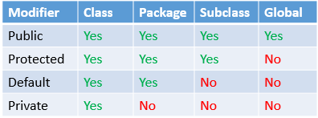


*  Subclass can **relax** the [access modifier](#access-modifier) but can't make it more **restrictive** as this would violate the rule that a subclass instance should be useable in place of a superclass instance.

    ```Java
    public abstract class A {
        protected void method();
    }

    public class B extends A {
        @Override
        public void method(){    // OK
        }
    }

    public class C extends A {
        @Override
        private void method(){    // Not Allowed
        }
    }
    ```

<br><br><br>
# Casting
---
<br>


* ## Primitives
    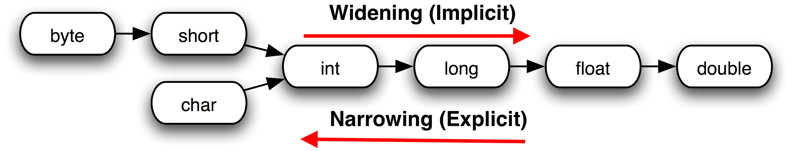


    * **Widening** conversion doesn't require an explicit cast as no information will be lost
    ```Java
    long l = 10
    ```
    <br>

    * **Narrowering** conversion requires an explicit cast as we are risking a possible loss of information
    ```Java
    loat a = 100.001f; <br>
    int b = (int)a; // Explicit cast, the float could lose info.
    ```

    <br>

* ## Objects <br><br>
    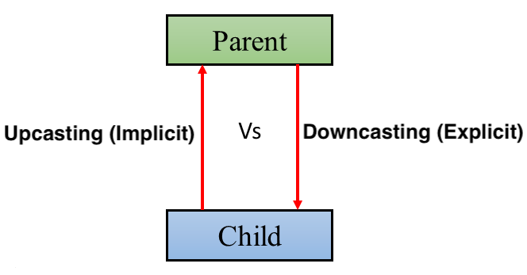

<br><br><br>
# Syntax
---
<br>

* ## ==
    * Primitives are ```==``` only if storing the same value
    * Objects are ```==``` only if stored in the same memory address

* ## strictfp
    *  Ensures that operation involving floating-points will remain platform independent

* ## final
    * On variable
        * Creates constant
        * If not assined to any value, it can only be initialized:
            * **static:** in static block / method
            * **non-static:**  by class constructor
    * On method
        * Prevents overriding
    * On class
        * Prevents inheritance 
<br><br>
* ## instanceOf
    * Compares instance with type

        ```Java
            Simple s = new Simple();  
            Simple s2 = null
            System.out.println(s instanceof Simple);
            System.out.println(s2 instanceof Simple);
        ```
        <blockquote>
        True <br>
        False
        </blockquote>
<br><br>
* ## Exception Handling
    <br>

    * ### Exception Class Hierarchy
    <br>

    * 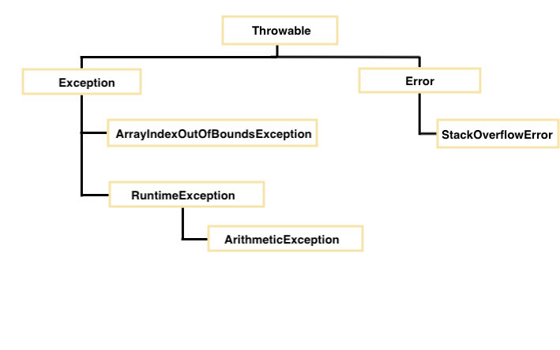

    <br>
    
    * ### Types of Exception

        * **Checked Exception** - checked at compile-time, e.g ClassNotFoundException
        * **Unchecked Exception** - checked at run time, as they cannot be checked at compile-time, e.g ArithmaticException
        * **Error** - a special unchecked exception, cause program to exist since they are not recoverable, e.g OutOfMemoryError
        <br><br>

    * ### Exception propagation
        * [Checked exception](#Checked-Exception) not propagated

        * An exception is first thrown from the top of the [stack](#Runtime-Data-Area) and if it is not caught, it will propagade down the stack until caught or until it reaches the bottom of the stack

    <br>

    <br>

    * ### Throws Overriding
        ```Java
        class Parent{
            void m()throws IOException{
                ......
            }
        }
        class Child extends Parent{
            
            @Override
            void m()throws IOException{ 
                // Rule 1:
                // throws must be IOException or any subclass of IOException

                // Rule 2:
                // overriden method m() can only throw an unchecked exception if the parent class m() doesn't throw an excepption
                ......
            }
        }        
        ```


    <br>

    * ### Throw vs Throws
        |  Throw | Throws |
        |:----|:---|
        | followed by instance or used within the method | follwed by class or method signature
        | use to throw exception explicitly | used to declare an exception |
        | cannot throw multiple exceptions |  can declare multiple exceptions e.g method() throws Exception1, Exception2 
        |checked exception cannot be propapagated with throw only | checked exception can be propagated |


    <br>

    *   ```Java
        int a[] = new int[1];

        try {
            System.out.println("Access element three :" + a[2]);
        } 
        // catch blocks are optional, could be just try followed by finally
        catch (NullPointerException e) { 
            System.out.println("1 | Exception thrown  :" + e);
        } 
        catch (ArrayIndexOutOfBoundsException e) {
            System.out.println("2 | Exception thrown  :" + e);
        }
        //
        System.out.println("notice this get's printed");

        // finally block is always executed (no matter if exception didn't occur or  
        // occured and was hadndled or occured and wasn't handled)
        
        // finally block not executed on System.exit() or fatal error abort
        finally {
            System.out.println("The finally statement is executed");
        }
        ```
        <blockquote>
        Exception thrown  :java.lang.ArrayIndexOutOfBoundsException: Index 2 out of bounds for length 1
        The finally statement is executed           
        </blockquote>

        <br>

        ```Java
        int a[] = new int[1];

        try {
            System.out.println("Access element three :" + a[2]);
        } 
        catch (Exception e) {  // <---------------------------------------------------
            System.out.println("1 | Exception thrown  :" + e);
        } 
        catch (ArrayIndexOutOfBoundsException e) {
            System.out.println("2 | Exception thrown  :" + e);
        } 
        finally {
            System.out.println("The finally statement is executed");
        }
        ```
        <blockquote>
        exception java.lang.ArrayIndexOutOfBoundsException has already been caught
        </blockquote>

        <br>
        Since Exception is the base class for all the exceptions, it must be used at last to handle the exception. No class can be used after this.
        <br>

<br><br>
* ## native
    * Method is implemented in native code e.g another programming language, could be C / C++ to access system or hardware resources or use an external library
<br><br>
* ## Static
    * Belongs to the class, not to the the object
    * Mark variable / method static if it's common across objects
    * No need to instantiate class to access static variable / method
    * Memory efficient
    * Static methods can't be overriden (design flaw IMO)
.
    <br><br>
    * ### Static block
        * Runs during the final stage of [Class loading](Class-Loader)
        * Will be run only onced and will finish before the class can be accessed in any way
        * Used to initialize static members
        * Can be used to executed program which doesn't have a [Main method](#main-method)

    <br><br>
    * ### Static import
        <br>
        Allows us to access the static members of a class without class qualifications
        <br><br>

        ```Java
        import static java.lang.Math.*;
        
        public class Sample{
            public static void main(String args[]){
                // static import allows us to skip Math in Math.sqrt(169)
                // this is possible only because Math.sqrt() is static itself
                System.out.println(sqrt(169));
            }
        }
        ```
<br><br>
* ## super
    * [Final](#final) reference to the current object's immediate parent (can't be reassigned)
    * Whenever we create instance of subclass, an instance of the parent class is created implicity
<br><br>
* ## this
    * [Final](#final) reference to the current object (can't be reassigned)
    * Can be used to refer to [static](#static) members of the class (bad practise) 


<br><br><br>
# Misc
---
<br>

* ## Constructor
    * Used to initialize the objects
    * Cant' be abstract, final or static
    * ```this()``` can be used to invoke current class constructor
    * ```super()``` can be used to invoke immediate parent class constructor
    * Both ```this()```and ```super()```must be the first statement in the constructor hence they can't be together
    <br><br>
    * ```super()``` is implicitly called if no ```super()``` or ```this()``` is specfied
        ```Java
        class Animal{  
            Animal(){System.out.println("animal is created");}  
        }

        class Dog extends Animal{  
            Dog(){  
            System.out.println("dog is created");  
            }  
        }  

        class Test{  
            public static void main(String args[]){  
            Dog d=new Dog();  
            }         
        }  
        ```
        <blockquote>
        animal is created 
        <br>
        dog is created
        </blockquote>


    <br>

    * ### Copy Constructor
        * Not inheritable

        ```Java
        class Student{  
            int age;  
            String name;  

            public Student (int age, String name){  
            this.age = age;  
            this.name = name;  
            }  
            
            //constructor to initialize another object  
            public Student (Student student){
            this.age = student.age;  
            this.name =student.name;  
            }
            
            public String toString() {
            return age + " " + name;
        }
        }  

        Student student1 = new Student(25,"Peter");
        Student student2 = new Student(student1);  

        System.out.println(student1);
        System.out.println(student2);
        ```


    <br><br>
    * ### Chaining using ```this```
        ```Java
        public class Employee  
        {  
            int id,age;   
            String name, address;  
            public Employee (int age)  
            {  
                this.age = age;  
            }  
            public Employee(int id, int age)  
            {  
                this(age);  
                this.id = id;  
            }  
            public Employee(int id, int age, String name, String address)  
            {  
                this(id, age);  
                this.name = name;   
                this.address = address;   
            }  
            public static void main (String args[])  
            {  
                Employee emp = new Employee(105, 22, "Vikas", "Delhi");  
                System.out.println("ID: "+emp.id+" Name:"+emp.name+" age:"+emp.age+" address: "+emp.address);  
            }  
            
        }`
        ```
        <blockquote>
        ID: 105 Name:Vikas age:22 address: Delhi
        </blockquote>
    <br>

    * ### Chaining using ```super```
        ```Java
        class Person  
        {  
            String name,address;   
            int age;  
            public Person(int age, String name, String address)  
            {  
                this.age = age;  
                this.name = name;  
                this.address = address;  
            }  
        }  
        class Employee extends Person   
        {  
            float salary;  
            public Employee(int age, String name, String address, float salary)  
            {  
                super(age,name,address);  
                this.salary = salary;  
            }  
        }  
        public class Test   
        {  
            public static void main (String args[])  
            {  
                Employee e = new Employee(22, "Mukesh", "Delhi", 90000);  
                System.out.println("Name: "+e.name+" Salary: "+e.salary+" Age: "+e.age+" Address: "+e.address);  
            }  
        }
        ```
        <blockquote>
        Name: Mukesh Salary: 90000.0 Age: 22 Address: Delhi
        </blockquote>
<br><br>    
* ## Java Runtime Environment (JRE)
    * JVM + the libraries, and other components to run Java apps
<br><br>
* ## Java Development Kit (JDK)
    * JRE + plus tools such as the compilers and debuggers necessary for development of Java Apps
<br><br>
* ## OpenJDK
    * An open-source version of the Oracle JDK. the main difference is licensing
<br><br>
* ## Serialization
    * By implementing either Serializable or Externalizable ```interface```
      |Serializable|Externalizable|
      |:--:|:--:|
      [Marker interface](#marker-interface) | Not a [marker interface](#marker-interface)
      | serialization logic handled by java| serialization logic has to be implemented by us|
      | Easier to implement but at the cost of performance | Harder to implement but better performance

    <br>

    * Serializable ```ìnterface```:
        * [Java Reflection](#Java-Reflection) figures out how to [marshall / unmarshall](#marshalling) the objects

    * ```transient``` member are not seralized
        * However they can be serialized if:
            * The ```transient``` object is serialized in readObject / writeObject or readExternalizable / writeExternalizable
            * A custom serialization library is used
    * ```static``` member is implicitly ```transient```

    * To avoid serializing child of the serializable base class:
        * Implementing ```writeObject()``` or ```readObject()``` in the subclass which throws ```NotSerializableException```

<br><br><br>
# Collections
---
<br>

DataStructures:
* <span style="color:Tomato">Not Synchronized</span> <span style="color:MediumSeaGreen">Synchronized</span> <br>
* Hashing based collections load factor = 0.75

<br>

* <span style="color:Tomato">ArrayList</span> <br>
    * Uses [Dynamic array](#dynamic-array) (Increases by 50% if filled)

* <span style="color:Tomato">LinkedList</span> <br>
    * Uses [Doubly linked list](#doubly-linked-list)

* <span style="color:Tomato">HashMap</span> 
    * Can contain one ```null``` key 

* <span style="color:MediumSeaGreen">HashTable</span> <br>
    * Cannot contain any ```null``` key 

* <span style="color:MediumSeaGreen">BlockingQueue</span> <br>
    * Provides concurrency in add, peek remove <br>
    * While peeking, it waits for the queue to be non-empty <br>
    * While adding, it waits for the available space <br>
    * Cannot contain ```null``` elements <br>

<br>

Iterator:
* Fail-fast Iterator 
    * Operates directly on the collection, fails if the collection being iterated through is modified <br>  e.g ```ConcurrentModificationException```

* Fail-safe Iterator
    * Operates on a cloned copy of the collection, hence can be modified through the iteration <br> e.g ```ConcurrentHashMap```

<br>

* Traverses in forward direction only
* Slower than Enumeration
* Used with List, Set, Map, Queue

<br>

* ListIterator
    * Traverses the elements in both forward and backward directions
    * Used in Lists only

    <br>

<br>


Comparable Vs Comparator
*   |Comparable|Comparator|
    |:---:|:---:|
    Used to sort the objects with natural ordering (alphabet,numbers) | Used to sort attributes of different objects
    Compares `this` reference with the object specified | Compares two different class objects provided
    Affects the original class | Doesn't affect the original class


<br><br><br><br>
# Multithreading
---
<br>

* ### Thread Vs Process
    
* Each processes has its own memory space, while threads share the process's resources 
* This makes thread communication more efficient and also problematic

<br>

* ### Thread Creation:
    |Thread Class| Runnable Interface|
    |:--:|:--:|
    | extends |implements
    | Each tread creates a unique object | Multiple threads share the same object
    | Various inbuild methods - getPriotiy() isAlive() etc...  | Single method - run()

<br>

* ### Callable Interface
    * Same as Runnable, except
    * Thread can return a result
    * Can throw a checked exception
<br>

* ### Thread Lifecycle
    <br>

    * New - Thread object created using ```new``` keyword, thread doesn't start until we call the ```start()```
    * Runnable - ```start()``` called, thread is ready but doesn't run until selected by the [thread scheduler](#thread-scheduler)
    * Running -  thread scheduler picks the read from the ready state and the thread is running
    * Non Runnable - thread is not running, but is still alive, or it is waiting for the other thread to finish
    * Terminated  - tread is terminated when the ```run()``` exits

        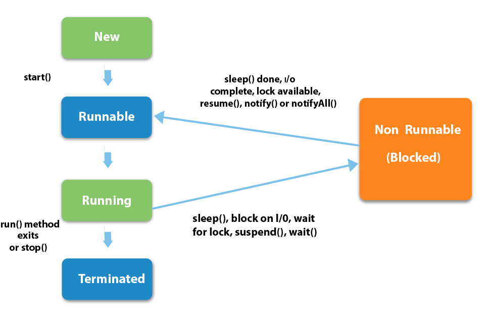

* ### Thread Scheduler    
    * Decides which tread should be executed
    * Determines the waiting time for a thread
    * Selects priority of a thread
    <br><br>
    * #### Schedules 
        * #### Preemptive
            * Highest priority thread executes until it enters the waiting or terminated state or a higher priority thread comes into existence
        * #### Time Slicing
            * Thread executes for a predefined amount of time and then reenters the pool of ready threads

<br>

* ### Thread Pool
    * Group of threads waiting for the task allocation
    * The idea is to have threads always existing, to avoid creation overhead

        

* ### Synchronization
    * Controling access to a critical section (shared resouces) used by multiple threads

    * Built around lock or monitor
        * Each object has a lock
        * Thread needing consistent access to an object's field has to acquire this lock
        * Thread no longer needing consistent access to an object's field releases this lock

        * Mutual Exclusive
            * Synchronized method
            * Synchronized block
            * Lock Interface
            * Static synchronization
                * On method
                    * Lock will be on the class

            * | Lock interface | Synchronized block|
              |:---|:---|
               Guarantee of sequence in which the waiting threads will be given the access | No Garuantee of sequence in which the waiting threads will be given the acess 
               No option to timeout if the lock is not granted | Provides option to timeout if the lock is not granted
               Lock() Unlock() can be called in different methods | Single Synchronized block must be fully contained in a single method 
  
        * Cooperation (Inter-thread communication)

* ### Atomic Action
    * Cannot be interrupted in between the start and completion of the action
    * All reads and writes operation for the primitive variable (except long and double) are the atomic operation.
    * All reads and writes operation for the volatile variable (including long and double) are the atomic operation.

    * ```i++ ``` is not atomic because ```i = i + 1```  requires one read and one write and another tread maight write into ```i``` in between
        * Use Atomic classes such as ```AtomicInteger``` to make these actions atomic

* ### notify() 
    * Defined in Object Class
    * Wakes up a single random thread
    * Must be inside synchronized block 

    * #### notifyAll()
        * Same as notify() except wakes up all the threads waiting for a lock

* ### wait()
    * Defined in Object Class
    * Releases the lock
    * Must be inside synchronized block
    * Affected by Notify()

* ### sleep()
    * Defined in Thread Class
    * Doesn't release the lock,  pauses the thread for a given amount of time

* ### join()
    * Waits for a thread to complete it's work

* ### interrupt()
    1. Sets the interrupt flag of the thread
    1. The code run
    1. 
    * Methods cons
        * wait(), sleep(), join() etc...
    * Breaks out from sleep or wait state

<br>

* ### volatile keyword
    * Marks variable visible to all threads
    * Good idea could be to mark a conditional check variable in the loop as ```volatile```

<br>


* ### Race Condition
    * When two or more threads compete for a shared resource, and the resulting final state of program depends on which one got the resource first.


        ```Java
        for ( int i = 0; i < 1000; i++ ){ 
            x = x + 1; 
        }
        ```
        <blockquote>
        Thread 1: reads x, value is 7 <br>
        Thread 1: add 1 to x, value is now 8 <br>
        Thread 2: reads x, value is 7 <br>
        Thread 1: stores 8 in x <br>
        </blockquote>

    <br>

* ### Deadlock
    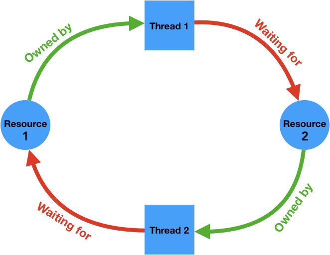

    * Thread 1 starts to use Resource 1.
    * Thread 1 and Thread 2 try to start using Resource 2
    * Thread 2 'wins' and gets Resource 2 first
    * Now Thread 2 needs to use Resource 1
    * Resource 1 is locked by Thread 1, which is waiting for Resource 2
    * The threads are in waiting state - deadlock

    * Prevention:
        Avoid nested, unnecessary locks
        join()

    * Debugging:
        Thread dump
        Logging

<br>

* ### Livelock
    * Similar to deadlock, except that the states of the threads involved is constantly changing with regard to another, 
    * The threads are still running, they are in livelock

<br>

* ### Starvation
    * Thread is unable to gain regular access to shared resources hence "starving"
    * E.g, Suppose an object provides a synchronized method that often takes a long time to return. If one thread invokes this method frequently, other threads that also need frequent synchronized access to the same object will often be "starved".


<br>

* ### Daemon thread
    * Low priority thread
    * Provide services to the [user threads](#user-threads)
    * Terminated by the JVM after all the user threads die

<br>

* ### Shutdown hook
    * Thread invoked before [JVM Shutdown](#JVM-Shutdown).
    * Can be used to implement user-defined cleanup procedure

<br><br><br>
# Misc 2 
---
<br>

    * Client must know the IP address and port number of the server

    <br>

    * ### Connection-Oriented (TCP/IP)
        * Classes:
            * Socket
            * ServerSocket
    * ### Connectionless (UDP)
        * Classes:
            * DatagramSocket
            * DatagramPacket


<br><br>
* ## Reflection
    * Process of examining or modifying behavior of a class at run time
    * Can access all the class members (including private)
    * Used in debuggers, testing tools etc...

<br><br>
* ## Java Compiler
    *  Compiles ```.java``` (source code) into ```.class``` (bytecode)
<br><br>
* ## Abstraction
    * [Abstraction](#Abstraction) OO Principle
    * Achieved by
        * Abstract Class
            
        * Interface
            * All fields are public static final implicitly (if not specified they are implicitly  assigned)
            * Marker Interface
                * An empty interface
                * Class will exhibits special behavior with respect to the interface implemented
                * E.g Serializable
    <br><br>
    * Common
        * Can't be instantied
        * Can have abstract methods, non-abstract methods, static methods, final methods
    * Difference

        | Abstract Class | Interface |
        |:----|:---|
        | class can **extend** only one class | class can **implement** multiple interfaces |
        | **Can** have Constructor| **Cannot** have  Constructor |
        | **Can** have Non-static fields | **Cannot** have Non-static members |
        | **Can** have state | **Cannot** have state (as all variables are public static final )|
    <br><br>
    * Abstract method
        * Can be used only in a abstract class, or interface
        * Cannot be [final](#final) or [static](#static) 
<br><br>
* ## Multiple Inheritance
    * Not supported in java to reduce complexity and prevent runtime errors
    ```Java
    class A{  
        void msg(){System.out.println("Hello");}  
    }  
    class B{  
        void msg(){System.out.println("Welcome");}  
    }  
    class C extends A,B  
        Public Static void main(String args[]){  
            C obj=new C();  
            obj.msg();//Now which msg() method would be invoked?  
        }  
    }  
    ```
    <blockquote>
    Compile Time Error
    </blockquote>
<br><br>
* ## Constant Pool
    * Contains:
        * [literals](#literal) specified by programmer
        * [symbolic references](#symbolic-references) generated by compiler
<br><br>
* ## Run-Time Constant Pool
    * Per class  or per-interface run-time representation of the [constant pool]#(constant-pool) table in a .class file


<br><br>
* ## Package
    * Namespace to organized related classes and interfaces
    * To manage access control
    * Avoids file name clashes
<br><br>
* ## Compile-Time Polymorphism (Overloading)
    * Also known as early binding, static binding, or static method dispach
    * Faster execution but less flexibility than [runtime polymorphism](#Runtime-Polymorphism)
    * Works **only** by modifying the method's parameters or as [covariant return type](#covariant-return-type)
<br><br>
* ## Runtime Polymorphism (Overriding)
    * Also known as late binding, dynamic binding, or dynamic method dispatch.
    * Slower execution but more flexibility than [compile-time polymorphism] (#Compile-Time-Polymorphism)
       ```Java
        class Animal{  
            int agility = 10;

            void makeSound(){
                System.out.println("silence")
            }  
        }

        class Dog extends Animal{  
            int agility = 5;

            void makeSound(){
                System.out.println("bark");   
            }

            public static void main(String args[]){  
                Animal obj = new Dog(); 
                System.out.println(obj.agility);  
                obj.makeSound();
            }
        }         
        ```
        <blockquote>
        10 <br>
        bark
        </blockquote>
        <br>
        As instance variables cannot be overriden, they are not subjected to runtime polymorphism
        <br><br>

    * ### Covariant return type
        * When method is overridden, the return type of the overriding method is allowed to be a subtype of the overriden method's return type
        <br><br>
        E.g, ```Object.clone()``` with return type of Object can be overriden as follows:

            ```Java
            public class Foo{
                ...

                // Note covariant return here, method does not just return Object
                public Foo clone(){
                    // Implementation
                }
            }
            ```

            The benefit is that any invoking ```Foo.clone()``` and know without casting that the return type value is an instance of ```Foo``` 
            <br><br>

            Without covariant return type, the overidden method in Foo would have to be declared to return ```Object``` hence the caller would have to explicitly [downcast](#casting) the result even though the caller know the return value can only ever be instance of ```Foo```

<br><br>
* ## Main method
    * If remove [static](#static) keyword from main method, and there is no [static block](#static-block) in our program, we get``` NoSuchMethodError```
    * If no args provided in CLI, the args[] will contain empty array, which is *not* Null
    * Can be overloaded, final
<br><br>
* ## Symbolic References
    * Names of classess, fields and methods referenced from the class
    * Used by JVM to link the class to other classes it depends on

    * E.g:
        ```Java
        System.out.println("Hello, world!");
        ```
        * Execute to inspect the [constant pool](#constant-pool) of a class :
        ```Shell
        > javap -verbose
        ```
        * Produces:
        ```
        0:   getstatic       #2; //Field java/lang/System.out:Ljava/io/PrintStream;         
        3:   ldc     #3; //String Hello, world!       
        5:   invokevirtual   #4; //Method java/io/PrintStream.println:(Ljava/lang/String;)cV 
        ```

        * #Number is symbol reference to the [constant pool](#constant-pool) <br>
            * #2 is a symbolic reference to ```System.out``` field <br>
            * #3 is a ```Hello, world!``` string <br>
            * #4 is a symbolic reference to ```PrintStream.println(String)V``` <br>
<br><br>
* ## Primitives
    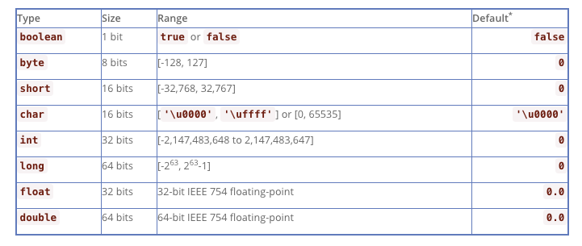

    

    <br>

    * ### Wrapper Class
        * Allow primitive types to be access as objects:

            * Autoboxing
                * Converting primitives to objects
            * Unboxing
                * Converting objects to primitives
    
        <br>

        * Integer Wrapper Class

            * Maintains ```IntegerCache```, by default from values -128 to 127 in which Integer.valueOf() returns object of mentionted range from that cache 

                <br>

                ```Java
                Integer one = 100; 
                Integer two = 100;
                    
                if(one == two){ //returns true as one and two are pointing to the same object
                    System.out.println("a");
                }
                else if(one.equals(two)){
                    System.out.println("b");
                }
                else{
                    System.out.println("c");
                }
                ```
                <blockquote>
                a
                </blockquote>

                <br>

                ```Java
                Integer one = 200; 
                Integer two = 200;
                    
                if(one == two){ //returns false as 200 > 127, hence the two Integers are not pointing to the same object
                    System.out.println("a");
                }
                else if(one.equals(two)){
                    System.out.println("b");
                }
                else{
                    System.out.println("c");
                }
                ```
                <blockquote>
                b
                </blockquote>
<br><br>
* ## Default Values
    * ### Instance variable
        * For primitives:
            [primitives default value](#primitives)
        * For objects:
            null
    * ### Local variable
        * Undefined
<br><br>
* ## Dynamic Linking
    * Translates [symbolic method references](#symbolic-references) into concrete method references, loading classes as necessary to resolve as-yet-undefined symbols, and translates variable accesses into appropriate offsets in storage structures associated with the run-time location of these variables.

<br><br><br>

# Order of Operations
---
<br>

```Java
// left operations has precedence over the right operations

System.out.println(10 + 20 + "Javatpoint");
System.out.println("Javatpoint" + 10 + 20);
```
---
<blockquote>
30Javatpoint <br>
Javatpoint1020
</blockquote> <br>

```Java
// * Has precedence over + 

System.out.println(10 * 20 + "Javatpoint");   
System.out.print("Javatpoint" + 10 * 20);   // as * Has precedence over +
```
<blockquote> 
200Javatpoint <br>
Javatpoint200
</blockquote> <br>

```Java
// / has precedence over = hence we divide integers first and then assign to double

double result = 9 / 2;   
System.out.println(result);
```
<blockquote> 
4.0
</blockquote> <br>

```Java
// In Java, for binary operator (division, asignment etc...) the operands must be of the same type. Namely in ```9 / 2 ``` Both 9 and 2 must be of the same type. If they are not the same type, we will do an implicit conversion 
// binary operator's operands must be of same type so first convert 2 to double, then do division, and then assign to double

double result = 9.0 / 2; 
System.out.println(result);
```
<blockquote> 
4.5
</blockquote> <br>

<br><br><br>
# I / O
---
<br>

* ## Stream
    * Sequence of data flowing from source to destination
<br><br>
* ## Byte streams
    * Byte:  8-bit byte
    * Use when not working with character stream e.g image, video 
    <br><br>
    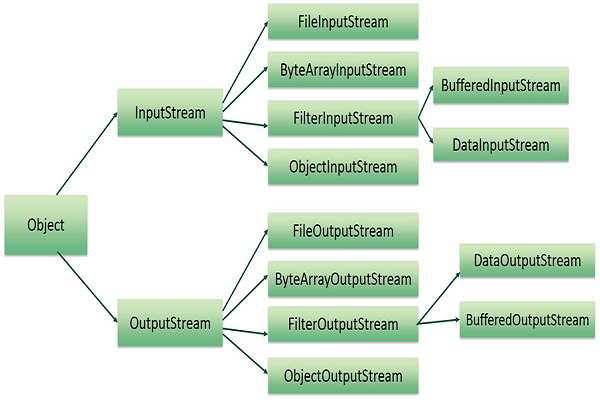
<br><br>
* ## Character Streams
    * Character: 16-bit Unicde System
    * Use when working with characters e.g textfile
    <br><br>
    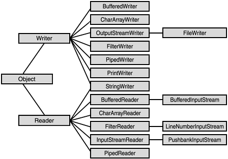


<br><br><br>
# Garbage Collector
---
<br>

* Process of removing the unreferenced objects from the memory
    <br><br>
    *  Objects can be unreferenced by:
        <br>
        * Nulling the reference
            ```Java
            Employee e = new Employee();  
            e = null;             
            ```
        <br>

        * Assigning the reference to another
            ```Java
            Employee e1 = new Employee();  
            Employee e2 = new Employee();  
            e1 = e2; // now the first object referred by e1 is available for garbage collection           
            ```
        <br>

        * Anonymous object
            ```Java
            new Employees();
            ```
* Is a [Daemon thread](#daemon-thread)
<br>

* ## Trade-offs
    * **Footprint:** amount of memory required by GC to run
    * **Throughput:**: Percentage of total time not spend in garbage collection
    * **Latency:** amount of time code has to pause for GC to run 
<br><br>
* ## Generational Hypothesis
    * Most objects die young, hence the GC algorithms usually split the heap into two generations:    
        * #### Young Generation
            * Splits into:
                * #### Eden space:
                for newly allocated objects   
                * #### Survival space:
                after object survives first GC
        <br>
        
        * #### Old Generation
            * Objects move here after surviging multiple GC 
            * Uses memory-efficient algorithm
        
        
<br><br>
* ## Implementations
    * ### Serial Garbage Collector
        * Single-threaded garbage collection, freezes all app threads
        * Smallest footprint of any collectors
        * Lacks multi-threading support (not suitable for server environments)
        * Great for programs with limited memory or if CPU is running lot of JVMs (helps limit GC impact on other JVMS as no other threads in the CPU are affected by this GC)
    * ### Parallel Collector
        * Multiple-threaded garbage collection but still freezes all app threads
        * In shortest amount of time, it will be able to collect the highest amount of garbage possible on multi-processor systems
        * Great for batch apps (i.e apps that can bear application pauses)
    * ### CMS Collector
        * Depracted
    * ### G1 Collector 
        * JVM's default collector and replacement for CMS collector
        * Ability to configure the max pause time
        * Most of work done concurrently (to minimize freezing of app threads)
        * Uses non-continous space, which is very efficient for large heaps (divids heap into small chunks):
        
        * Run GC on [Eden space], all survived objects gets copied to [Unassigned space], this [Unassigned space] becomes a [Survival space] and [Eden space] becomes [Unassigned space]

        * G1 instead of clearing the entire heap or large space as in other GC, it only clears those small chunks in memory that are ful or almost full
        * Great for apps which need predictable latency (due to maxTargetPauseTime) 


<br><br><br>
# Python
---

* General-Purpose programming language
* [Dynamically Typed](#Statically-Typed-Vs-Dynamically-Typed)
* [Interpreted](#Compliled-Vs-Interpreted-Language) 
    * Python interpreter compiles the source code ```.py``` into the bytecode ```.pyc```
    * This bytecode is executed by the Python's virtual machine
* [OOO](#Object-Oriented-Programming) <br>
    \+ Supports all types of [inheritance](#inheritance)<br>
    \- Weak encapsulation as it has no [access specifiers](#access-specifiers) - relies on programmers being adults <br>
* CPython - the most prevalent Python implementatio

<br>
<br>


```Python
# Vocabulary:
# pep8                  - rules that specify how to format python code
# monkey patching        - modifies class or module at runtime
#                       - can be used in testing 
# pickling / unpickling - used to serialize / deserialize python objects by converting them into a char stream
#
#
#
#
#
# Objects:
# in python everything is an object
# objects divide into:
#   mutable: - passed by reference 
#   list, dict, set, bytearray, objects, functions, almost everything else
#   
#   immutable: - passed by value
#   int, float, bool, string, bytes, tuple, frozenset, None  


# Variables
# static variable:
#declared inside the class definition but not inside a method
class MyClass:
    static_var = 2

# can be accessed as follows:
MyClass.static_var   

# global variables and immutable objects:
a = 2                  # global var 
c = 5                  # global var
d = 10                 # global var
e = 10                 # global

def func():
    a = 4              # local var
    b = 3              # local var
    global d           # restricts us from having local d var inside func      
    d = 15 
    x = globals()['e'] # allows us from having local e var inside  fimc

    print(a)   # 4
    print(b)   # 3
    print(c)   # 5

print(a)       # 2
print(b)       # NameError
print(c)       # 5
print(d)       # 15

# Env Variables:
# pythonhome     - the path to the standard python libs
# pythonpath     - the path where python looks for libs that aren't installed directly in the python distribution


 

# Functions:
# first-class object - allows us to treat funcs like any other object (can be assigned to variables, returned from other functions and passed into functions)
# func without return statement returns None object

# Passed by assignment
# local link: file:///Users/peter/lib/notes/res/cs/1.mp4

# func default parameters
# python evaluates them only once
# if one invocation modifies the default parameter and the default parameter is a mutable object then each subsequent invocation receives the modified  default parameter

# once we define a func it creates a new list, every subsequent call to this func without a list argument will use the same list
def extendList(val, list=[]):
    list.append(val)
    return list        

list1 = extendList(10)
list2 = extendList(123,[])
list3 = extendList('a')

print(list)  # raises NameError, since list is local to func    
print(list1) # [10, 'a']
print(list2) # [123]
print(list3) # [10, 'a']

# Method Resolution Order
# specifies order followed when resolving a member reference (e.g in multiple inheritance)
# example below if we look for func() we first search class D then class B and lastly class C
class D(B, C): pass

 D.__mro__ # <class '__main__.D'>, <class '__main__.B'>, <class '__main__.C'>, <type 'object'>)


# nonlocal keyword
def outer_func():
  a = 2
  b = 3
  def inner_func():
    nonlocal a
    a = 4
    b = 6
  inner_func()
  return (a, b)

print(outer_func())  # (4,3)


# Closure
# is an inner function, that remembers and has access to variables in the local scope in which it was created, even after the outer_func has finished executing


def outer_func(msg):
    message = msg

    def inner_func():
        print(message)
    
    return inner_func

hello_func = outer_func('hello')
world_func = outer_func('world')

hello_func()  # hello
world_func()  # world


# Operator overloading
class fruit:
    def __init__(self, type, size):
        self.type = 'fruit'
        self.type = type
        self.size = size

    def __gt__(self, other):
        if self.size > other.size:
            return True
        return False


orange = fruit('orange', 7)
apple = fruit('apple', 8)
apple > orange              # True


# Assignments:
min = a if a < b else    # ternarty operator

a = 1 ; b = 2
a, b = b, a              # swaps values
a, b                     # 2 1

a = 1
a, b = a + 1, a + 1      # simulatnous declaration
a, b                     # 2 2


# Lists:
[1, 2]                   # [1, 2]
list('string')           # ['s', 't', 'r', 'i', 'n', 'g']
list([1,2])              # [1, 2]
list((1,2))              # [1, 2]

l = [1, 2, 3, 1]
l2 = l[:]                # shallow copy
l3 = copy(l)             # shallow copy
import copy
l4 = copy.deepcopy(l)     # deep copy

l.remove(1)              # [2, 3, 1]
del l[1]                 # [2, 1]
a = l.pop()              # 
a                        # 1
l.append(6)              # [2, 6]
                            
l2 = [7, 8]             
l.extend(l2)             # [2, 6, 7, 8]
l.reverse()              # [8, 7, 6, 2]
                         # equal to [::-1] but modifies the original list
l.insert(1,3)            # [8, 3, 7, 6, 2] 

l = [(2, 2), (3, 4), (4, 1), (1, 3)]
def take_second(elem):
    return elem[1]
l.sort(key=take_second) # key can be either func or other callable
                          # tules are sorted by first parameter by default
l                       # [(4, 1), (2, 2), (1, 3), (3, 4)]
l.sort(key=take_second, reverse=True)
l.sort(key=len)         # [(3, 4), (1, 3), (2, 2), (4, 1)]

list(zip(('a','b','c'),(1,2,3)))     # [('a', 1), ('b', 2), ('c', 3)]
list(zip(('a','b','c'),(1,2)))       # [('a', 1), ('b', 2)]


# Tuples:
t = (1, 2, 3)
t[1] = 5                # throws error as tuples are immutable
a, b, c = t             # tuple unpacking
t = 1, 2, 3             # tuple packing
t                       # (1, 2, 3)

# Names Tuples
# can think of it as a lightweight object

from collections import namedtuple

Color = namedtuple('Color', ['red', 'green', 'blue'])
color = Color(55, 155, 255)                     # rgb example
color2 = Color(red = 55, green=155, blue=255)
color.red                                       # 55
color.red                                       # 55


# Sets:
l = [1,1,2,2,3,3]
set(l)                   # {3, 1, 2}
frozenset(l)             # frozenset{3, 1, 2}


# Dicts:
# are insertion ordered 
dict(b = 1, a = 2)             # {'b': 1, 'a': 2}
dict([('b', 1), ('a', 2)])     # {'b': 1, 'a': 2}

d = dict(list(zip(('b','a','c'),(1,2)))) # {'b': 1, 'a': 2}
sorted(d.keys())               # ['a', 'b']
sorted(d.values()              # [1, 2]


# Strings:
# immutable
s = "aba"
s[1] = 'a'    # TypeError

s = 'a'      
print(id(s))  # 140184731426864
s = 'b'
print(id(s))  # 140184730615408


# concat
s = 'a' + 'b' # 'ab'
s = 'a' + 5   # TypeError

# manipulation
s = 'Test'
s.swapcase()      # 'tEST'
s.upper()         # 'TEST'
s.lower()         # 'test'
s.capitalize()    # 'Test"

s.isupper()       # False
                  # special chars such as @, # etc.. true for both isupper(), islower()
s.islower()       # False
s.istitle()       # True
s.isalnum()       # True
s = 'TestA TestB TestC'
s.isspace()       # False
s = ''
s.isspace()       # True
+-------------+-----------+-------------+----------------------------------+
| isdecimal() | isdigit() | isnumeric() |          Example                 |
+-------------+-----------+-------------+----------------------------------+
|  True       |  True     |  True       | "038", "੦੩੮", "０３８"            |
|  False      |  True     |  True       | "⁰³⁸", "🄀⒊⒏", "⓪③⑧"          |
|  False      |  False    |  True       | "↉⅛⅘", "ⅠⅢⅧ", "⑩⑬㊿", "壹貳參"|
|  False      |  False    |  False      | "abc", "38.0", "-38"             |
+-------------+-----------+-------------+----------------------------------+
# icdecimal() ⊆ isdigit() ⊆ isnumeric() i.e if string is decimal, it will also be digit and numeric

l = ('a', 'b', 'c')
'|'.join(l)       # 'a|b|c'

s = '  xoxo love xoxo   '
s.lstrip()      # 'xoxo love xoxo  '
s.rstrip()      # '  xoxo love xoxo'
s.strip()       # 'xoxo love xoxo' 
s.strip(' xoe') # 'lov'
s.strip('stx')  # '  xoxo love xoxo  '

s = 'test this example'
s.split()               # ['test', 'this', 'example']
s.split(None, 1)        # ['test', 'this example']

s = "this is \nstring example....\nwow!!!" 
s.splitlines()  # ['this is ', 'string example....', 'wow!!!']

s = "vivian"
s.replace('i', 'x')      # 'vxvxan"
s.replace('i', 'x', 1)   # 'vxvian'


# Numbers
1.1 + 2.2 > 3.3      # True
                     # because of flawed floating-point arithmetic


# Identity:
a is b                    # reference equality
a == b                    # value equality
id()                      # gives unique identification number of the object, same objects will have same identification
foo = 1
bar = foo
baz = bar
fii = 1
if foo is bar and foo is baz and foo is fii:
    print(id(foo))        # 140361348553000
    print(id(bar))        # 140361348553000
    print(id(baz))        # 140361348553000
    print(id(fii))         # 140361348553000
                          # means they are all the same objects

type((1))                 # <class 'int'>
type((1,))                # <class 'tuple'>
type(lambda : '')         # <class ‘function’>
isinstance((1, ), tuple)  # True
issubclass(b, a)          # True if b is subclass of a
type(int('5'))            # <class 'int'>
type(str(5))              # <class 'str'>
chr(75)                   # 'K'
ord('K')                  # 75
                          # 75 is the ASCII value


# Slicing:
# creates a new object

[1,2,3,4,5,6][2:4]    # [3, 4]
(1,2,3,4,5,6)[4:2]    # ()
(1,2,3,4,5,6)[4:2:-1] # (5, 4)
(1,2,3,4,5,6)[::-1]   # (6, 5, 4, 3, 2, 1)
(1,2,3,4,5,6)[2:]     # (3, 4, 5, 6)
'Hello'[:-1]          # 'Hell


# Comprehension:
[i**2 for i in range(1, 5)]            # [1, 4, 9, 16]
[i for i in range(1, 5) if i % 2 == 0] # [2, 4]
{i**2: i for i in range(1, 5)}          # {1: 1, 4: 2, 9: 3, 16: 4}


# Map, Filter, Reduce:
# map
m = lambda x: x**2 
list(map(m, range(10)))         # [0, 1, 4, 9, 16, 25, 36, 49, 64, 81]

# filter
f = lambda x: x % 2 != 0 and x % 3 != 0
list(filter(f, range(10)))       # [1, 5, 7]

# reduce
import functools
r = lambda x, y: x + y
functools.reduce(r, range(10))   # 45


# Enumeration:
l = [2,4,6,8]

for i, e in enumerate(l, 1):
    print(i,e)
    # 1 2
    # 2 4
    # 3 6
    # 4 8


# Decorator:
# is func that adds func to another func without modifying it
def decor(func):
    def wrapper(*args):
        print('***********')
        return func(*args)
    return wrapper

@decor
def sum(a,b):
    return a + b 

print(sum_(1,2))
## ***********
## 3


    


# Naming Conventions:
class Test():
    def __init__(self):                       # __foo__ reserved for builtin mmembers

            self._semiprivate = 'Hello'       # _foo semiprivate just for convetion
                                                # from M import * doesn't import these members

            self.__superprivate = ' world'    # __foo to prevent accidental access
                                                # __superprivate gets converted to _Test__superprivate

t = Test()
print(t._semiprivate)                         # 'Hello'
print(t.__superprivate)                       # raises AttributeError
print(t._Test__superprivate)                  # 'world


# Docstring:
# unlike comment, documentation string is retained during runtime
def sayhi():
    '''
    The function prints Hi
    '''
    print("Hi")

sayhi.__doc__                # retreives the docstring


# *Args **Kwargs:
def func(required_arg, *args, **kwargs):
    # required_arg is a positional-only parameter.
    print(required_arg)

    # args is a tuple of positional arguments,
    # because the parameter name has * prepended.
    if args: # If args is not empty.
        print(args)

    # kwargs is a dictionary of keyword arguments,
    # because the parameter name has ** prepended.
    if kwargs: # If kwargs is not empty.
        print(kwargs) 

func("required argument") 
# required argument
func("required argument", 1, 2, '3')
# required argument
# (1,2,'3)
func("required argument", 1, 2, '3', keyword1=4, keyword2="foo") 
# required argument 
# (1,2,'3) 
# {'keyword2': 'foo', 'keyword1': 4} 


# Iterable:
  for x in iterable
#  doesn't have state
#  methods:
   __getitem__ # used for indexed lookup
   __iter__    # returns new iterator

# Iterator
#  has state that remembers where it is during iteration
#  methods:
   __next__    # returns the next value in the iteration
               # updates the state to point at the next value
               # signals when it is done by raising StopIteration
   __iter__    # returns itself

s = "cat"      # s is an iterable
t = iter(s)    # returns new iterator
next(t)        # c 
d = next(t)    # returns itsef so we can do maybe something like do_stuff(d)
next(d)        # t
next(t)        # raises StopIteration exception 


# Generator - Subtype of Iterator:
def mygenerator(n):
    yield n
    yield n + 2
    yield n - 4

g = mygenerator(10)
print(next(g))                # 10
print(next(g))                # 12
print(next(g))                # 6
print(next(g))                # raises StopIteration exception

# they naturally describe infinite streams
def fib():
    a, b = 0, 1
    while True:
        yield a
        a, b = b, a + b

import itertools
print(list(itertools.islice(fib(), 10))) # [0, 1, 1, 2, 3, 5, 8, 13, 21, 34]

# generator expressions
# succintly describe certain common types of generators
ge = (n for n in range(10,16,2))

print(next(ge)) # 10
print(next(ge)) # 12
print(next(ge)) # 14
print(next(ge)) # raises StopIteration exception


# Package:
# www.pyypi.org - python package index, has large collection of packages 
#
# create package:
# __init__.py marks dir as python package dir
#└── mypackage
#    ├── __init__.py
#    └── mymodule.py
# use package:
from mypackage import mymodule


# Memory
# CPython uses private heap to store all the objects and data structures, as there is no way to know if let's say function local value will outlive it's function (closures)

# Memory reclamation
# Circular references or Circular imports(form of circular reference created with import statement)
    # Handled by GC

    #e.g:
    def function_a():
        function_b()

    def function_b():
        function_a()

# Non-Circular references
    # Handled by reference counting i.e Python VM keeps an count of how many references refer to an object, and automatically garbage collects it when tehere are no more references refering to it.


# Releasing Memory
gc.collect() # force garbage collector to release unreferenced memory, however this can


# Resource handling:

# with:
# declaration 
class MyClass:
    def __init__(self): #  constructor can be omitted to enforce the class to be initialized only using with statement
        self.files = []

    def __enter__(self): # use to return my_class_obj
        return self

    # ...

    def __exit__(self): # called regadless exception is thrown
        for file in self.files:
            os.remove(file)
# usage
with MyClass() as my_class_obj:
    # use my_class_obj


# working with files
try :
    with open('<abs path to file>', 'rt') as f: 
        # modes: e.g rwt
        # 'r' - Read   - Default value. Opens a file for reading, error if the file does not exist
        # 't' - Text   - Default value. Text mode
        # "b" - Binary - Binary mode (e.g. images)
        # 'a' - Append - Opens a file for appending, creates the file if it does not exist
        # 'w' - Write  - Opens a file for writing, creates the file if it does not exist
        # 'x' - Create - Creates the specified file, returns an error if the file exist
        for l in f:
            pass
except IOError:
    print('File not found')


# Exceptions
try:
    try_this(whatever)
except SomeException as the_exception:
    handle_SomeException(the_exception)
    # Handle a instance of SomeException or a subclass of it.
except Exception as the_exception:
    generic_handle(the_exception)
    # Handle any other exception that inherits from Exception
    # - doesn't include GeneratorExit, KeyboardInterrupt, SystemExit
    # Avoid bare `except:`
else: # there was no exception whatsoever
    return something()
    # if no exception, the "something()" gets evaluated,
    # but the return will not be executed due to the return in the finally block below
finally:
    # this block will execute no matter what, even if no exception,
    # after "something" is evaluated but before that value is returned
    # but even if there is an exception.
    # a return here will hijack the return functionality. e.g.:
    return True # hijacks the return in the else clause above


# Multithreading
# GIL - Global Interpreter Lock, prevents multiple threads from running Python code at the same time. This is because CPython's dynamic memory management is not thread safe

import multiprocessing # instead of running multiple threads it runs multiple processes each with their own GIl so they can run at hte same time


from multiprocessing import Pool

def f(x):
    return x*x

if __name__ == '__main__': # necessary to avoid infinite loop
    with Pool(5) as p:
        print(p.map(f, [1, 2, 3])) # [1, 4, 9]


# Misc:
eval('print(max(1,2))')   # parses a string as an expression
input("Enter a number:")  # prompt
range(0,6,2)              # [0, 2, 4]
max('A','a')              # 'a'
dir()                     # lists all the members of the current object
help('modules')           # lists all the available modules 


print('executes before if __name__ == \'__main__\':')
if __name__ == '__main__':
    print 'This program is being run directly'
else:
    print 'I am being imported from another module'

 __del__                   # called when the object is garbage collected
#                          del can be used to call __del__ method
#                          del decremends the reference count by one, so if object has more than one reference 
#                          the __dell__ won't be called


# Modules:

# Copying
import copy
b = copy.copy(a)      # shallow copy
b = copy.deepdcopy(a) # deep copy


# importlib
# used for dynamic module loading
import importlib
module = importlib.import_module('my_package.my_module')

# os 
import os
os.getcwd()
os.oschdir()
os.remove()               # remove file/dir

# re
import re
s = "The rain in Spain" 

re.split("\s", s)            # ['The', 'rain', 'in', 'Spain']
m = re.search('.ain',s)   
m.group()                    # rain
m.group(0)                   # rain
re.sub("\s", "9", txt)       # 'The9rain9in9Spain'
re.sub("\s", "9", txt, 2)    # 'The9rain9in Spain'

# random
import random
l = [1, 2, 3]
random.shuffle(l)         # 3, 2, 1
random.choice(l)         # 2
random.random()          # 0.9799350301184551
                         # number between 0 to 1
random.randint(2,7)      # 5
                         # inclusive to 2 and 7
```

<br><br><br>
# Algorithms


---
<br>

<br>

```Python 
# Initializing min / max
import math

min_val = math.inf
max_val = -math.inf 

# Updating min / max    
min_val = min(min_val, min_val_candidate)
max_val = max(max_val, max_val_candidate)

# Swap values
a, b = 2, 3
a, b = b, a
```

<br>

## Sliding Window

<br>

* ### Recognition
    * Need to iterate over sequentially to **calculate** the (min, max, longest, shortest, contains etc..) of a **contigious** sequence (subarr, substring, nodes)

<br>

* ### Fixed length window
    
    <br>

   

    <br>

    ```Python
    # *Max* sum of a *subarray*


    import math

    def largest_contigious_sum(arr):
        if len(arr) < 1:
            return None
        
        max_sum = -math.inf
        curr_sum = 0

        for arr in arr:
            # compute sum for previous subarray
            curr_sum += arr
            
            # if current sum <= the current arrber,
            # no need to include previous subarray
            if curr_sum <= arr:
                curr_sum = arr
                
            max_sum = max(max_sum, curr_sum)  
        return max_sum

    print(largest_sum_per_subarr([-2,1,-3,4,-1,2,1,-5,4])) # 6 because [4,-1,2,1]
    print(largest_sum_per_subarr([-4,-3,-2,-1])) # 4
    ```

    <br>

    ```Python
    # *Max* sum of a *subarray* of length 3


    import math

    def max_contigious_sum(arr, k):
        if len(arr) < k:
            return None

        max_val = -math.inf
        curr_sum = sum(arr[:k])
        left = 0 ; right = k
        
        while right < len(arr):
            curr_sum = curr_sum - arr[left]
            curr_sum = curr_sum + arr[right]

            if max_val < curr_sum:
                max_val = curr_sum

            left += 1 ; right += 1

        return max_val


    print(max_contigious_sum([4,2,1,7,8,1,2,8,1,0],3)) # 16
    ``` 
        


<br>

* ### Dynamically Resizable window

    <br>

   

    <br>

    ```Python
    # *Smallest* *subarray* with sum equal to or larger than target_sum   


    import math

    def smallest_subarray_with_sum(arr, target_sum):
    if len(arr) < 1:
        return math.inf

    left = 0 ; right = 0
    min_size = math.inf
    current_sum = 0

    while right < len(arr):
        current_sum += arr[right]
        while current_sum >= target_sum:

            if arr[right] == target_sum:
                return 1

            min_size = min(min_size, right - left)

            current_sum -= arr[left]
            left += 1

        right += 1

    return min_size + 1  # as array indexes start with 0


    print(smallest_subarray_with_sum([4, 2, 1, 7, 8, 5, 14], 19)) # 2 
    print(smallest_subarray_with_sum([4,2,2,7,8,1,2,8,1,0],8)) # 1
    print(smallest_subarray_with_sum([2],8)) # -inf
    ``` 

    <br><br>

    ```Python
    # *Longest* *substring* with k disintct chararacters


    import math

    def longest_substr_with_dist_chars(substr, k):
        if len(substr) < 1:
            return -math.inf

        left = 0 ; right = 0
        max_size = -math.inf
        mem = {}

        while right < len(substr):
            if substr[right] not in mem:
                mem[substr[right]] = 1
            else:
                mem[substr[right]] = mem[substr[right]] + 1
            
            while len(mem) > k:
                if mem[substr[left]] == 1:
                    del mem[substr[left]]
                else:
                    mem[substr[left]] = mem[substr[left]] - 1

                left += 1

            max_size = max(max_size, (right - left))
            right += 1

        return max_size + 1 # as array indexes start with 0


    print(longest_substr_with_dist_chars("aaahhibc", 3)) # 6
    print(longest_substr_with_dist_chars("aaakhhhibc", 3)) # 7
    ``` 

    <br><br>

    ```Python
    # *Smallest* *substring* containg all the characters


    import math

    def smallest_substr_containing_chars(str, set):
        left = 0 ; right = 0
        min_val = math.inf
        mem = {}

        while right < len(str):
            if str[right] not in mem:
                mem[str[right]] = 1
            else:
                mem[str[right]] += 1
            right += 1 

            while all([c in mem and mem[c] > 0 for c in set]):
                min_val = min(min_val, right - left)
                
                mem[str[left]] -= 1
                left +=1

        return min_val


    print(smallest_substr_containing_chars('abczdacb',{'a','b','c','d'})) # DACB 4
    print(smallest_substr_containing_chars('aaaabaa',{'a'})) # A 1
    ```

    <br>


## Dynamic programming
* Global solution by dividing the problem into subproblems

* ### Process
    1. Identify the subproblems
    1. Identify how these subproblems relate to build the global solution

    <br>

    ```Python
     # *Max* sum of a *subarray*


    def largest_contigious_sum(arr):
        if len(arr) < 1:
            return None

        curr_sum = 0
        max_sum = arr[0]

        for i in range(len(arr)):                
            # Subproblem 1:  Start with new item?
            # Subproblem 2:  Continue max subarray with this item

            # Best answer between the subproblems
            curr_sum = max(arr[i], arr[i] + curr_sum) 

            # Global Best answer          
            max_sum = max(max_sum, curr_sum) 

        return max_sum
        


    print(largest_sum_per_subarr([-2,1,-3,4,-1,2,1,-5,4])) # 6 because [4,-1,2,1]
    print(largest_sum_per_subarr([-4,-3,-2,-1])) # 4

    ```

    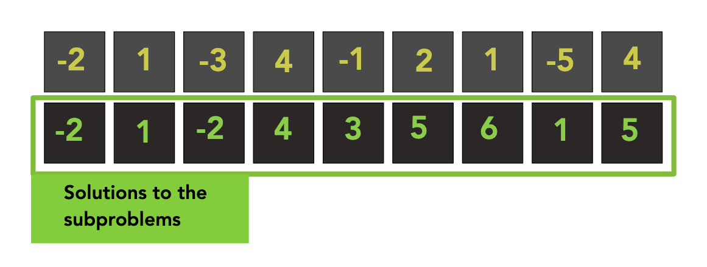

    <br>

    ```Python
    # Given staircase with n steps, how many ways there is to go up the stairs, if we can only take 1 or 2 steps at the time
    # https://www.youtube.com/watch?v=5o-kdjv7FD0&ab_channel=CSDojo


    def num_ways_of_ways(n):
        nums = [-1] * (n + 1)
        nums[0] = 1
        nums[1] = 1

        for i in range(2,n+1):
            nums[i] = nums[i - 1] + nums[i - 2]
        return nums[n]


    print(num_ways_of_ways(4)) # 5
    ```

    <br>

    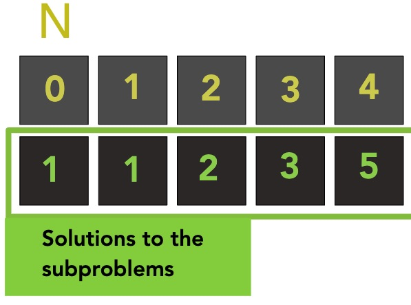

    <br>

    ```Python
    # Find number of sets that adds up to sum


    def count_sets(arr, sum):
        mem = dict()
        return dp(arr, sum, len(arr) - 1, mem)

    def dp(arr, sum, pointer, mem):
        key = "{0}:{1}".format(sum, pointer)
        if key in mem:
            return mem[key]

        if sum == 0:
            return 1
        elif sum < 0 or pointer < 0:
            return 0

        else:
            to_return = dp(arr, sum - arr[pointer], pointer - 1, mem) + dp(arr, sum, pointer - 1, mem)
        
        mem[key] = to_return
        return to_return


    print(count_sets([6,4,10,2], 16)) # 2 because [6,10]
    ```

<br>


## Greedy
* Makes locally optimal choice at each stage with the hope of finding the global optimum

    <br>

    ```Python
    # Say you have an array for which the ith element is the price of a given stock on day i. If you were only permitted to complete at most one transaction (i.e., buy one and sell one share of the stock), design an algorithm to find the maximum profit., Note that you cannot sell a stock before you buy one.


   import math

    def max_profit(prices):
        max_val = 0
        min_val = math.inf

        for i in range(len(prices)):

            if prices[i] < min_val:
                min_val = prices[i]
            else:
                max_val = max(max_val, prices[i] - min_val)

        return max_val
        


    print(max_profit([7,1,5,3,6,4])) #5
    print(max_profit([7,6,4,3,1]))# 0
    ```


## Covers 80% Problems
1. [Sliding Window](#Sliding-Window)
1. [Nested Intervals](#Nested-Intervals)
1. [Recursion / Seach](#Recursoin-Search)
1. [Dynamic Programming](#Dynamic-Programming)

<br>

## Generic Problem
1. Come up with a brute-force solution
1. Think of a simpler version of the problem
1. Think with simpler examples -> try noticing a pattern
1. Use some visualization
1. Test your solution on a few examples

<br>


```Python
# *Smallest* *substring* that contains all of the characters


## Nested Intervals
```Python
# Return wheather or not the brackets are appropriately balanced


def nested_interval(str):
    open_list = ['(', '[', '{']
    close_list = [')', ']', '}']
    stack = []
    for c in str:
        if c in open_list:
            stack.append(c)
        elif c in close_list:
            pos = close_list.index(c)
            if len(stack) > 0 and stack[-1] == open_list[pos]:
                stack.pop()
            else:
                return False
    return True if not stack else False


print(nested_interval('(3 + 9{12 + 4})(25)'))
```


## Dynamic Programming


<br><br><br>
## 2D Arrays
```Python
# Given a 2D grid, count the number of islands in the array. Water is represented by 0 and Island is represented as 1 that's connected in the NSEW direction
# T = O(n^2)


def num_of_islands(grid):
    N = len(grid)
    count = 0

    for row in range(N):
        for col in range(N):
            if grid[row][col] == 1:
                recur(grid, col, row)
                count +=1 
    return count

def recur(grid, row, col):
    if row < 0 or col < 0 or row > len(grid) -1 or col > len(grid) - 1 or grid[row][col] != 1:
        return
    
    grid[row][col] = 3

    recur(grid, row + 1, col)
    recur(grid, row - 1, col)
    recur(grid, row, col + 1)
    recur(grid, row, col - 1)


print(num_of_islands([
    [1,1,1],
    [0,0,1],
    [1,1,1]
]))
```

```Python
# Given a 2D arary that represents an image, rotate the image by 90 degrees clockwise
# https://www.youtube.com/watch?v=IdZlsG6P17w&t=307s&ab_channel=NickWhite
# T = (n^2)


def rotate_image(img):
    N = len(img)

    #transpose
    for i in range(N):
        for j in range(i, N):
            tmp = img[i][j]
            img[i][j] = img[j][i]
            img[j][i] = tmp

    #mirror
    for i in range(N):
        for j in range(N // 2):
            tmp = img[i][j]
            img[i][j] = img[i][N - 1 - j]
            img[i][N -1 - j] = tmp

    return img


print(rotate_image([[1,2,3],
                    [4,5,6],
                    [7,8,9]]))
```

<br><br><br>
# Intervals
```Python
# Max inverval overlap
# https://www.geeksforgeeks.org/find-the-point-where-maximum-intervals-overlap/


# T and S = O(max_c) 
def max_interval_overlap(arr_a, arr_b):
    max_a = max(arr_a)
    max_b = max(arr_b)
    max_c = max(max_a, max_b) 

    arr_c = [0] * (max_c + 2)
    for i in range(len(arr_a)):
        arr_c[arr_a[i]] += 1
        arr_c[arr_b[i] +1 ] -= 1
       
    max_val = -math.inf
    total = 0
    index = 0

    for i in range(len(arr_c)): 
        total += arr_c[i]
        if max_val < total :
            max_val = total
            index = i 
    print("max_val: {0} at index: {1}".format(max_val, index))


max_interval_overlap([1,2,10,5,5], [4,5,12,9,12])
```

```Python
# Merge overlapping intervals
# https://practice.geeksforgeeks.org/problems/overlapping-intervals4919/1


# T = O(nlog(n))
def merge_overlapping_intervals(arr):
    arr.sort()
    result = []
    result.append(arr[0])

    j = 0
    for i in range(1, len(arr)):
        if arr[i][0] >= result[j][0] and arr[i][0] > result[j][1]:
            result.append([arr[i][0], arr[i][1]])
            j += 1
        elif arr[i][0] >= result[j][0]:
            result[j] = [result[j][0], max(result[j][1], arr[i][1])]
        elif arr[i][0] <= result[j][0]:
            result[j] = [arr[i][0], max(result[j][1], arr[i][1])]
    return result


print(merge_overlapping_intervals([(1, 6), (2, 5), (3, 8), (6, 8), (9, 10), (11, 12)]))
print(merge_overlapping_intervals([(1, 3), (2, 4), (6, 8), (9, 10)]))
print(merge_overlapping_intervals([(6, 8), (1, 9), (2, 4), (4, 7)]))
```

<br><br><br>
## Search
```Python
# Binary Search
# T= O(log(n))


def binary_search(term, arr):
    first = 0
    last = len(arr)

    while first < last:
        mid_point = (first + last) // 2
    
        if term == arr[mid_point]:
            return True
        elif term > arr[mid_point]:
            first = mid_point + 1
        else:
            last = mid_point - 1

    return False


print(binary_search(11, [1,4,5,8,9,11,15]))
```

<br><br><br>
## Sorting
```Python
# Sort an almost sorted array where only two elements are swapped
# https://www.geeksforgeeks.org/sort-an-almost-sorted-array-where-only-two-elements-are-swapped/?ref=lbp
# T = O(n)


def sort_almost_sorted(arr):
    for i in range(len(arr)):
        if arr[i] > arr[i + 1]:
            p1 = i
            break

    for i in range(len(arr)-1, 0, -1):
        if arr[i] < arr[i - 1]:
            p2 = i
            break
        
    arr[p1], arr[p2] = arr[p2], arr[p1]
    return arr


print(sort_almost_sorted([10,20,60,40,50,30]))
print(sort_almost_sorted([10,20,40,30,50,60]))
print(sort_almost_sorted([1,5,3]))
```

```Python
# Given sorted array of integers, write a function that returns a sorted array containing the squares of those integers
# https://www.youtube.com/watch?v=4eWKHLSRHPY&ab_channel=NickWhite
# O(n)


def sort_squared(arr):
    new_arr = [0] * len(arr)
    p1 = 0
    p2 = len(arr) - 1

    for n in range(len(arr) - 1, -1, -1): 
        if abs(arr[p1]) < abs(arr[p2]):
            new_arr[n] = arr[p2] ** 2                
            p2 -= 1
        
        else:
            new_arr[n] = arr[p1] ** 2                
            p1 += 1
        
    return new_arr


print(solution([-7,-1,3,4,8,12]))
```


<br><br><br>
## Math
```Python
# return nth row of pascal triangle


def pascal_triangle(n):
    pt = [[1],[1,1]]

    for i in range(1, N):
        tmp = [1]

        for j in range(i):
            tmp.append(pt[i][j]+pt[i][j+1])
        tmp.append(1)
        
        pt.append(tmp)
    return pt[N]


print(pascal_triangle(3))
```

```Python
# Find all prime numbers up to limit n


def sieve_of_eratosthenes(n):
    if n < 2:
        return []
    
    flags = [True] * (n + 1) 

    for p in range(3, math.ceil(math.sqrt(n)), 2): # O1 # O3
        if flags[p] == True:
            for num in range(p*p,(n+1),p): # O2
                flags[num] = False

    return [2] + [i for i in range(3, n, 2) if flags[i]]


# Sieve of Eratosthenes works by recognizing that all non-prime numbers are divisble by a prime number <br><br>
# O1
* If a number n is not a prime, it can be factored into two factors a and b. If n = a * b
now a and b can't be both greater than the sqrt(n), since then the product a * b would be greater than sqrt(n) * sqrt(n) = n. so in any factorization of n, at least one of the factors must be smaller than the sqrt(n), and if we can't find any factors less than or equal to the square root, n must be a prime.
# O2:
# Starts from p*p because all multiple of p smaller than p*p are already checked in prior loops.
# O3:
# Check only odd numbers
# T = O(Nlong(N))
sieve_of_eratosthenes(100)
```


<br><br><br>
## Arrays & Strings

```Python
# Find longest prefix


def longest_prefix(arr):
    for i in range(len(min(arr, key=len))):
        mem = arr[0][i]
        for e in arr:
            if e[i] != mem:
                return e[:i]
    return None


print(longest_prefix(['flower','flow','floight']))
print(longest_prefix(['doga','dogo','dogb'])
```

```Python
# Is sub_arr subset of arr?

def is_subset(sub_arr, arr):
    for i in range(len(arr)):
        if sub_arr[0] == arr[i]:
            j = 1
            while j < len(sub_arr):
                if sub_arr[j] != arr[j+i]:
                    break
                elif sub_arr[j] == arr[j+i] and j == len(sub_arr) - 1:
                    return True
                j += 1
    return False
print(is_subset([0,3,5],[7,5,1,3,5,0,9])
```


```Python
# Reverse array


def reverse_array(array):
    N = len(array)

    for index in range(N // 2):
        tmp = array[index]
        array[index] = array[N - 1 - index]
        array[N - 1 - index] = tmp
    return array


print(reverse_array([1,2,3,4,5]))
```

```Python
# Given an array arr of n integers where n > 1, return an array output such that arr[i] is equal to the product of all the elements of arr except arr[i]
In: [1,2,3,4] 
Out: [24,12,8,6]
https://www.youtube.com/watch?v=khTiTSZ5QZY&ab_channel=NickWhite


def product_except(array):
    N = len(array)
    result = [1] * N
    result[0] = 1

    for item in range(1, N):
        result[item] = array[item - 1] * result[item - 1]

    product = 1
    for item in range(N - 1, -1, -1):
        result[item] = result[item] * product
        product = product * array[item]

    return result


print(product_except([1,2,3,4]))
```

```Python
# Find first recurring character in a arr


def first_recurring(arr):
    seen = set()

    for e in arr:
        if e not in seen:
            seen.add(e)
        else:
            return e
    return None


print(first_recurring('abc'))
```

```Python
# Find first non-recurring element in a array


def first_non_recurring(arr):
    lookup = dict()

    for e in arr:
        if e in lookup:
            lookup[e] += 1
        else:
            lookup[e] = 1

    for e in arr:
        if e in lookup and lookup[e] == 1:
            return e
    return None


print(first_non_recurring('abc'))
```


```Python
# Partition Labels
# https://www.youtube.com/watch?v=ED4ateJu86I&ab_channel=KevinNaughtonJr.


def max_partitions(str):
    mem = {}
    res = [] 

    for i,l in enumerate(str):
        mem[ord(l) - ord('a')] = i
    
    i = 0
    j = 0

    while j < (len(str)):
        max_val = mem[ord(str[j]) - ord('a')]

        while i <= max_val:
            max_val = max(max_val, mem[ord(str[i]) - ord('a')])
            i += 1

        res.append(i - j)
        j = i
    return res


print(max_partitions('ababcbafcadefhkliji'))
print(max_partitions('ababcbacadefegdehijhklij'))a
```


```Python
### Is there sum in two arrays that adds to v?


def sum_of_two(arr_a, arr_b, v):
    complements = set()

    for num in arr_a:
        complements.add(v - num)
    
    for complement in complements:
        if complement in arr_b:
            return True
    return False


print(sum_of_two([1,2,3], [10,20,30,40], 42))
```

```Python
# Given an array nums of n integers and an integer target, find three integers in nums such that the sum is closest to target, terurn the sum of the three integers
# https://www.youtube.com/watch?v=qBr2hq4daWE&list=PLU_sdQYzUj2keVENTP0a5rdykRSgg9Wp-&index=31&ab_channel=NickWhite


def sum_3_closest(arr, t):
    arr.sort()
    r_sum = arr[0] + arr[1] + arr[-1]
    
    for i in range(len(arr) - 1):
        a = i + 1
        b = len(arr) - 1

        while(a < b):
            c_sum = arr[i]+ arr[a] + arr[b]

            if c_sum > t:
                b -=1
            elif c_sum < t:
                a +=1
            else:
                return c_sum

            if abs((c_sum - t) < abs(r_sum -t)):
                r_sum = c_sum
    return r_sum


print(sum_3_closest([-1,2,1,-4],1))
```

<br>

## LinkedList

<br>

```Python
class Node:
    def __init__(self, val):
        self.next = None
        self.val = val

class LinkedList:
    head = None

    def __init__(self, nodes):
        for node in nodes:
            self.append(node)

    def __str__(self):
        if self.head == None:
            return

        vals = []

        current = self.head
        while current != None:
            vals.append(current.val)
            current = current.next

        return str(vals)

    def prepend(self, val):
        if self.head == None:
            return

        new_head = Node(val)
        new_head.next = self.head
        self.head = new_head

    def append(self, val):
        if self.head == None:
            self.head = Node(val)
            return

        current = self.head
        while current.next != None:
            current = current.next

        new_node = Node(val)
        current.next = new_node

    def remove(self, val):
        if self.head == None:
            return

        if self.head.val == val:
            self.head = self.head.next

        current = self.head
        while current.next != None:
            if current.next.val == val:
                current.next = current.next.next
                return
            current = current.next

    def get_middle(self):
        if self.head == None:
            return

        sp = self.head
        fp = self.head
        
        while fp != None and fp.next != None:
            sp = sp.next
            fp = fp.next.next
        
        return sp

    def reverse(self): 
        prev = None

        current = self.head 
        while current != None:
            next = current.next
            current.next = prev 
            prev = current 
            current = next
        self.head = prev

    def return_kth_to_last(self, k):
        self.reverse()
        c = 0
        current = self.head
        while current.next != None and c != k:
            current = current.next
            c += 1
        return current

    def is_palindrome(self):
        if self.head == None:
            return

        #find middle element if one exists
        sp = self.head #slow pointer
        fp = self.head #fast pointer
        mid = None

        while fp != None and fp.next != None:
            sp = sp.next
            fp = fp.next.next
        
        #if fp != None means if linkedlist has odd length
        if fp != None:
            mid = sp.next #mid equals midpoint + 1
        else:
            mid = sp
        
        #reverse second half of the list
        prev = None
        while mid != None:
            next = mid.next
            mid.next = prev
            prev = mid
            mid = next

        #palindrom comparison
        while prev != None:
            if prev.val != self.head.val:
                return False
            prev = prev.next
            self.head = self.head.next

        return True
    
    def sort(self):
        #in general, merge sort is the best-suited sorting algorithm for sorting linked lists efficiently. 
        pass

    def remove_duplicates_unsorted(self):
        if self.head == None:
            return

        current = self.head
        set = {current.val}

        while current.next !=  None:
            if current.next.val not in set:
                current = current.next
                set.add(current.val)
            else:
                tmp_current = current
                while current.next != None and current.next.val in set:
                    current = current.next
                tmp_current.next = current.next


    def remove_duplicates_sorted(self):
        #self.sort()

        if self.head == None:
            return

        current = self.head

        while current.next != None:
            if current.val < current.next.val:
                current = current.next
            else:
                tmp_current = current
                while current.next != None and current.val == current.next.val:
                    current = current.next
                tmp_current.next = current.next
```
<br>

## Stack

```Python
# Design stack with min(), which returns the minimum element. push, pop and min should all be O(1)


import math


class Node:
    def __init__(self, val, last_min):
        self.next = None
        self.val = val
        self.last_min = last_min


class Stack:
    top = None
    last_min = None
    
    def __init__(self, nodes):
        for node in nodes:
            self.push(node)


    def __str__(self):
        return str(self.top.val)


    def push(self, val):
        if self.top == None:
            self.last_min = math.inf

        new_top = Node(val, self.last_min)
        new_top.next = self.top
        self.top = new_top

        if val < self.last_min:
            self.last_min = val


    def min(self):
        if self.top == None:
            raise Exception("Stack is Empty")
        
        return self.last_min


    def pop(self):
        if self.top == None:
            raise Exception("Stack is Empty")

        if self.top.val == self.last_min:
            self.last_min = self.top.last_min
                    
        tmp_top = self.top
        self.top = self.top.next
        return tmp_top


    def peek(self):
        if self.top == None:
            raise Exception("Stack is Empty")

        return self.top.val


    def is_empty(self):
        return self.top == None


Stack stack = Stack([2,1,4,9])
stack.pop()
print(stack.min()) # 4
```

<br>

## Trees
```Python
#use to solve majority of tree problems

#find one or more base cases
#call the same func on the left subtree
#call the same func on the right subtree
#joining the results

#sum of values
def tree_sum(root):
    if root is None:
        return 0
    else:
        left_sum = tree_sum(root.left)
        right_sum = tree_sum(root.right)
        return root.data + left_sum + right_sum


#max value
def tree_max(root):
    if root is None:
        return - math.inf
    else:
        left_max = tree_max(root.left)
        right_max = tree_max(root.right)
        return max(root.data, left_max, right_max)


#find height
def tree_height(root):
    if root is None:
        return 0
    else:
        left_height = tree_height(root.left)
        right_height = tree_height(root.right)
        return 1 +  max(left_height, right_height)


#check if value exists in tree
def exists_in_tree(root, value):
    if root is None:
        return False
    else:
        in_left = exists_in_tree(root.left, value)
        in_right = exists_in_tree(root.right, value)
        return root.data == value or in_left or in_right
    
#reverse tree
def reverse_tree(root, value):
    if root is None:
        return
    else:
        reverse_tree(root.left)
        reverse_tree(root.right)
        root.left, root.right = root.right, root.left


#tree longest consecutive seq
def tree_longest_consecutive_seq(root, count, target, max):
    if root is None:
        return
    elif root.val == target:
        count += 1
    else:
        count = 1
    
    max = max(max, count)
    tree_longest_consecutive_seq(root.left, count, target +1, max)
    tree_longest_consecutive_seq(root.right, count, target +1, max)
```
<br><br>

```Python
# given a sorted(increasing order) array with unique integer elements, write an algorithm to create a binary search tree with minimal height
# In: [1,2,4,6,7,8,10]
# Out:
#
#     (6)
#     ↙↘  
#   (2) (8)
#   ↙ ↘   ↙ ↘ 
# (1)(4) (7)(10)


arr = [1,2,4,6,7,8,10]
def build_min_bst(arr):
    mid = len(arr) // 2

    if len(arr) > 0:
        node = TreeNode(arr[mid])
        node.left = build_min_bst(arr[:mid])
        node.right = build_min_bst(arr[mid+1:])
        return node
node = build_min_bst(arr)


print(node.left.left)
```


