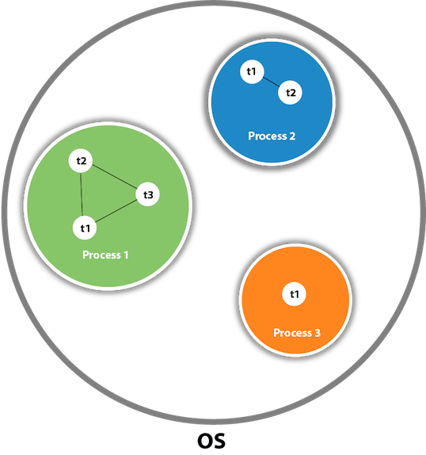

# todo
* GC, Object cloing(71)(221)(222)(226), casting, 38, 49, 50, 56, 85

<br><br><br>
# Definitions
---

* ## Context Switch
    * Process of storing the state of a process or thread, so that it can be stopped and another task resumed

    * Can occur as a result of [interrupt](#interrupt), such as when another process needs to access disk storage etc..

    * This allows multiple processes to share a single CPU

* ## Marshalling
    * process of converting the data into a byte-stream
    * this conversion is achieved through [serialization](#serialization)
    * UnMarshalling is the reverse process of Marshalling

* ## Buffer
    * Temporary storage to hold data

    * Use case:
        *   Reading/Writing one by one can be inefficient, especially if cost of these operation is high <br><br>
            OS Data Reading/Writing Subroutine is very expensive, instead of reading/writing one byte at time time we can read/write thousand of bytes at once to / from a temporary structure called buffer 

* ## ADT
    * Abstract data type, describes behavior but not the implementation e.g:<br><br>
    Graph, List, Map, Priority Queue, Queue, Set, Stack, Tree

* ## Data Structure
    * Concrete implementation of the abstract datatype e.g: <br><br>
    List -> Arraylist, Linkedlist <br>
    Map  -> Hashmap, Treemap

* ## Serialization
    * Process of writing the state of an object into a byte stream
    * Used wto transfer the object's state through network over store it on the disk
    * Deserialization is the reverse process of Serialization

* ## String Interning
    * Method to save the runtime memory by preserving a pool of immutable strings in a string intern pool
    * Subsequent string creation, can just check this pool, if string already exists just return it from the pool instead of creating a new one
    * Example of [flyweight-design-pattern](#flyweight-design-pattern)

* ## Recursive Algorithm
    * All recursive algorithms can be implemented iteratively, although they may be more complex

    * Space complexity will be at least O(n) where n is the depth of the recursive call

* ## Log Base
    * Logs in computer science implicitly imply base 2 (whereas in math it's base 10)


<br><br><br>
# Arrays and Strings
---
* arrays and string questions are often interchangeable
* ordered
* sequentially stored in memory
* can be either static or dynamic in size
    <br><br>
* ## Dynamic Array 
    <a id="Dynamic Array"></a>
    * when array is full, create a new array with double the size of the original one (resizing factor can vary), and copy all the elements to the new array
    <br><br>
    * ### String Concation
        * strings are usually immutable which can result in a major performance bottleneck during repepetitive concat operation  

        * consider the following, a list of string in which all strings are same length (l) and there are n strings. 

            ```Python
            sentence = "
            for s in strings:
                sentence.append(s)

            ```

        <br>

        * On each concat a new string object needs to be created in memory and two strings must be copied over character by character. In first iteration we copy l characters, on second 2l, third 3l and so on... O(l + 2l + 3l .. nl) which reduces to O(ln<sub>2</sub>) because 1 + 2 + ... n = $ \frac{n(n+1)}{2} $ or O(n<sup>2</sup>) + the l prefix
        <br>
        * to prevent this concat bottleneck whenever we manipulate strings many times, we should use a language specific tool for the job, such as a [dynamic array](#dynamic array) of the strings, which initially allocates space that is hoped to be larger than the final string and appends the strings to this array as necessary without a need to create a new string object on each subsequent manipulation

<br>
    
* ## Time Complexity
    |operation|complexity|comment|
    |:---:|:---:|:---|
    |access |O(1)| if items are consecutively stored in memory and each takes fixed  space, we can just multiply the initial memory by let's say 5 to access the 5th element of the array e.g cars[5]
    |insert |O(n) / O(1)| if array is full we need to create a new array and copy all the items to it which takes O(n) but happens so rarely that it can be said that the it's [amortized](#amortized) insertion time is O(1) <br><br> why copy all items into the array is O(n) ? well final capacity increase is n/2, previous capacity increase n/4 ... second capacity increase 2 elements to copy, first capacity increase 1 element to copy therefore the total number of insertion is $ \frac{1}{2} + \frac{1}{4} + \frac{1}{8} ... + 2 + 1 $ which is equal to just less than N
    |remove |O(n) / O(1)| we might have to shift n elements to transform the array back to the consecutive form, but if removed from the end can be O(1) 
    |search |O(n)| need to scan the entire array |

<br><br><br>

# Object-Oriented Programming
---
* Based on objects, promotes modularity and reusability
<br><br>
* ## 4 Pinricples
    * ### Encapsulation
        * hiding data by restricting direct access
        * access can be given using getter and setter methods
    * ### Abstraction
        * hiding implementation details by focusing on what object does rather than how it does it 
        * applied using abstract class or interface
    * ### Inheritance
        * class Dog extends Animal
        * reduces duplicate code
    * ### Polymorphism (translated as many forms)
        * ability to treat a class of an object as if it is the parent class
        * e.g Dog that inherits from Animal. Polymorphism is the ability to tre
<br><br>
* ## Object-Oriented Programming vs Object-Based Programming
    * ### Object-Oriented Programming:
        * follow all 4 OOP principles
    * ### Object-Based Programming
        * do not follow all the OOP principes such as inheritance and polymorphism
        * have built-in objects e.g window object in JavaScript
<br><br>
* ## Association, Aggregation, Composition
    <br>
    
    * **Association** - I have a relationship with an object. Foo uses Bar
        ```
        public class Foo { 
            void Baz(Bar bar) {
            } 
        };
        ```
    * **Aggregation** (weak relationship) - I have an object which I've borrowed from someone else. When Foo dies, Bar may live on.
        ```
        public class Foo { 
            private Bar bar; 
            Foo(Bar bar) { 
            this.bar = bar; 
            }
        }
        ```
    * **Composition** (strong relationship) - I own an object and I am responsible for its lifetime. When Foo dies, so does Bar
        ```
        public class Foo {
            private Bar bar = new Bar(); 
        }
        ```
        

<br><br><br>
# Java Virtual Machine (JVM)
---

* ## Subsystem 1. Class Loader
    * ### Phase 1: Loading
        * Loads ```.class``` files into memory

        * #### Three built-in classloaders:
            * #### Bootstrap Class Loader
                * loads ```.class``` files from rt.jar (a.k.a runtime jar)  which contains all class files of Java Standard Edition e.g java.lang etc...
            * #### Extension Class Loader
                * child of Bootstrap Class Loader
                * loads additional jar files located inside $JAVA_HOME/jre/lib/ext
            * #### System/Application Class Loader
                * child of Extension Class Loader
                * loads the class files from the classpath (our application class files) 
                * classpath set to current dir by default, modifiable by -cp switch)
    <br><br>
    * ### Phase 2: Linking
        * #### Step 1: Verify
            * bytecode class files are verified if they conform to standards 
        * #### Step 2: Prepare
            * memory allocated for static variables and default values are assigned 
        * #### Step 3: Resolve
            * all [symbolic references](#symbolic-reference) are replaced with actual references
    <br><br>
    * ### Phase 3: Initilization
        * all static variables are assigned with the actual values
        * static initializers are executed 
  <br><br><br>
* ## Subsystem 2. Runtime Data Area 
    <span style="color:Tomato">shared-to-all-threads</span> | <span style="color:MediumSeaGreen">per-threads</span> <br><br>

    * #### <span style="color:Tomato">Class(Method) Area</span>
        * responsible for holding class level information such as [runtime constant pool](#runtime-constant-pool), static fields, static methods etc
    <a id='heap'></a>
    * #### <span style="color:Tomato">Heap</span>
        *  used to allocate memory to objects at run time
        *  slower allocation (compared to stack)
        *  no size limit
        *  allocated when new objects are created and deallocated by garbage collector when they are no longer referenced
    * #### <span style="color:MediumSeaGreen">Stack</span>
        *  used to store data and partial results which will be needed while returning value for methods or [dynamic linking](#dynamic-linking)
        *  each method invocation creates a new stack frame, subsequently each method invocation completion destroys the stack frame
        * faster allocation (compared to heap)
        * size limit (meaning size is usually smaller than heap)
        * allocated when method is called and deallocated when method returns
    * #### <span style="color:MediumSeaGreen">Native Method Stack</span>
        *  contains all the native methods
    * #### <span style="color:MediumSeaGreen">Program Counter Register</span>
        *  contains the address if an instruction that JVM is currently executing
<br><br><br>
* ## Subsystem 3. Execution Engine
    * Converts bytecode to machine code and executes the instructions
    * Contains:
        * ### Interepreter
            * reads and execute bytecode 
            * the problem with interepreter is that, when method is called multiple times, it interprets those lines of bytecode again and again
        * ### Just-In-Time (JIT) Compiler
            * helps overcome the problem with the interpreter, when repeated method call occur, JIT compiles the bytecode to native code. This native code will be used directly for the repeated method calls
            * components to achieve this feautre:
                * intermediate code generator - generates intermediate code
                * code optimizer - optimizes the intermediate code
                * target code generator - converts intermediate code to native machine code
                * profiler - it is responsible for finding the methods which are called repeatedly
        * ### [Garbage Collector](#garbage-collector)
        * ### Java native method interface
            * make native libraries available for the execution engine
<br><br><br>
* ## JVM Shutdown
    * ### In controlled process
        * The last non-[daemon](#daemon-thread) terminates.
        * Interrupt signal from the OS (Ctrl + C)
        * System.exit()
        <br><br>
        * Subsequently
            * JVM Starts all the [Shutdown-hooks](#Shutdown-hook) in an unspecified order


    * ### Abruptly
        * Host OS dies
        * Kill signal from the OS (kill - 9 <jvm_pid>)
        * Runtime.getRuntime().halt()


<br><br><br><br><br>
# Class
* ## Runtime Class
    * Only one instance of ```Runtime class``` per java application
    * Used to interfact with java runtime environment e.g execute process, invoke GC etc...

* ## Singleton Class
    ```Java
    public class Singleton {
        private static Singleton singleton = new Singleton();

        // private Constructor prevents any other class from instantiating this class
        private Singleton() {}

        // static 'instance' method
        public static Singleton getInstance() {
            return singleton;
        }
    }

    Singleton singleton = Singleton.getInstance();
    ```
* ## Read-only
    * mark all fields ```private```
    * contains only getters methods
* ## Write-Only
    * mark all fields ```private```
    * contains only setter methods
* ## Immutable
    * mark all fields ```final```
    * mark ```class``` as ```final```

* ## Nesting    
    * ### Nested Class
        * A ```class``` which is declared inside another ```class``` or ```interface```

        * A ```class``` defined inside an ```interface``` is implicitly ```static```
    * ### Nested Interface
        * An ```interface``` which is declared inside another ```class``` or ```interface```
        <br><br>
        * Must be ```public``` if declared inside another ```interface```
        * Can have any [access specifier](#access-specifiers) if declared inside another ```class```
        <br><br>
        * An  ```interface``` declared inside an ```interface``` or ```class``` is implicitly ```static```
    <br><br>
    * Used to logically group classes & interfaces in one place
    * Can access all the members of it's outer class (including private members)
    <br><br>
    * Increase total number of classes used, which can result in additional workload for [JVM](#JVM), because if we don't instantiate the nested classes explicitly, they will still all be instantiated implcitly upon instantiating the outer class

    <br>

    * ### Static Nested Class
        *   ```Java
            package myapp;

            public class OuterClass {
                public static class StaticNestedClass {
                    
                }
            }
            ```
        * Declared as static member of another class
        * Can access only ```static``` members of it's ```OuterClass```
        * Doesn't require the ```OuterClass``` to be instantiated before it can be used
            <br>

            ```Java         
            OuterClass.StaticNestedClass nestedStaticObject = new OuterClass.StaticNestedClass();
            ```
        <br><br>
    * ### Non-Static Nested Class (Also known as Inner Classes)
        *   ```Java
            package myapp;

            public class OuterClass {
                public class InnerClass {
                    
                }
            }
            ```
        * Declared as an instance member of another class
        * Can access both ```static``` and ```non-static``` members of it's ```OuterClass```
        * Requires the ```OuterClass``` be instantiated before it can be instantied and used
            ```Java        
            OuterClass OuterClass = new OuterClass();
            OuterClass.InnerClass InnerObject = OuterClass.new InnerClass();
            ```

        * ### Futher divided into:
            <br>

            * ### Local Inner Class
                ```Java
                public class A{  
                    private int val = 30; 
                    
                    void display(){  
                        class B{  
                            void msg(){System.out.println(val);}  
                        }
                            
                        B b = new B();  
                        b.msg();  
                    }  
                }

                A a = new A();  
                a.display();
                ```
                <blockquote>
                30
                </blockquote>
                <br>

                * Created within a method
                * Use when more than one instance is to be created

            <br>

            * ### Anonymous Inner Class
                ```Java
                abstract class A{  
                    abstract void display();  
                }  

                A a = new A(){  
                    void display(){System.out.println("abstract method display() implemented inside an Anynomous Inner Class");}  
                };

                a.display();
                ```
                * Synthactically convenient way of writing a local inner class as it is Anonymous (name will be decided by the java compiler)
                * Use when only single instance is to be created
                * Can be used to implement abstract method, intherface etc ...

---
<br><br><br><br><br>
# Object Class
---

* ## toString()
    * java compiler interanally invokes toString() when trying to obtain the string representation of an object (e.g with print statement)

<br><br><br><br><br>
# Strings
---
* Are Immutable
    <br>

    ```Java
    String s="Apple";  
    s.concat(" Juice"); //concat() method appends the string at the end  
    System.out.println(s);
    ```
    <blockquote>
    Apple
    </blockquote>

<br>

* ## String Pool
    * JVM implementation of [string interning](cs.ipynb)
    * strings in the string pool are java objects which is contrast to [constant pool](#constant-pool) where strings are seralized and not Java Objects 
    * located in [heap](#heap)  <br><br>

* ## String Compairson
    ```string1 == string 2``` checks if the reference of the strings is the same. <br>
    ```string.equals(string2)``` checks if the content of the strings is the same <br><br>
    
    <br><br>
   
    ```Java
    // 1. Checks if String literal already exists in the String Pool.
    // 2. Since it doesn't, creates new String literal object in the String Pool 
    // 3. Returns reference of the newly created object ing the String Pool
    String s1 = "Cat"
    
    // 1. Checks if String literal already exists in the String Pool.
    // 2. Since it exists, no need to create new String literal object
    // 3. returns the reference to the already existing String pool object
    String s2 = "Cat"
    
    // 1. Creates a new String object in heap memory
    // 2. Checks if String literal alread yexists in the String Pool
    // 3. If exists does nothing, If doesn' creates new string ltieral object and adds it to the the String Pool.
    // 4. Returns reference to the heap (non-pool) object
    String s3 = new String("Cat") 
    String s3 = new String("Dog") // Creates 2 Objects, 1 in heap, 1 in String Pool

    s1 == s2  // true
    s1 == s3  // false
    
    s3 =  s1.intern() // intern() return String object reference from String Pool
    s1 == s3  // false
    ```
    <br>
* ## StringBuilder Vs StringBuffer
    * Refer to [Dynamic Array string concat](#Dynamic-Array)
    <br><br>

        |StringBuilder|StrigBuffer|
        |:--:|:--:|
        |unsynchronized|```synchronized```|
        |faster (since unsynchronized)| slower (since ```synchronized```)|

* ## Security
    * ### Vulnerability:
        * ```String``` stays in the [String Pool](#String-Pool) until garbage collected. If we store a secure data into a string, it stays in the memory for a prolonged period of time, hence any attacker could exploit Memory-Dump exploit to access the secure data.
    * ### Patch
        * Use ```CharArray()``` as we can set it to blank whenever we are done with it, with no trace left in memory.

<br><br><br><br><br>
# Access Specifiers
---
* order doesnt matter e.g **static public** void and **public static** void are the same <br><br>
    

<br><br><br><br><br>
# Casting
---

* ## Primitives
    


    * **Widening** conversion doesn't require an explicit cast as no information will be lost
    ```Java
    long l = 10
    ```
    <br>

    * **Narrowering** conversion requires an explicit cast as we are risking a possible loss of information
    ```Java
    loat a = 100.001f; <br>
    int b = (int)a; // Explicit cast, the float could lose info.
    ```

    <br>

* ## Objects <br><br>
    

<br><br><br><br><br>
# Syntax
---
<br><br>

* ## strictfp
    *  Ensures that operation involving floating-points will remain platform independent

* ## final
    * On variable
        * creates constant
        * if not assined to any value, it can only be initialized:
            * **static:** in static block / method
            * **non-static:**  by class constructor
    * On method
        * prevents overriding
    * On class
        * prevents inheritance 
<br><br>
* ## instanceOf
    * compares instance with type

        ```Java
            Simple s = new Simple();  
            Simple s2 = null
            System.out.println(s instanceof Simple);
            System.out.println(s2 instanceof Simple);
        ```
        <blockquote>
        True <br>
        False
        </blockquote>
<br><br>
* ## Exception Handling
    <br>

    * ### Exception Class Hierarchy
    <br>

    * 

    <br>
    
    * ### Types of Exception

        * **Checked Exception** - checked at compile-time, e.g ClassNotFoundException
        * **Unchecked Exception** - checked at run time, as they cannot be checked at compile-time, e.g ArithmaticException
        * **Error** - a special unchecked exception, cause program to exist since they are not recoverable, e.g OutOfMemoryError
        <br><br>

    * ### Exception propagation
        * [Checked exception](#Checked-Exception) not propagated

        * An exception is first thrown from the top of the [stack](#Runtime-Data-Area) and if it is not caught, it will propagade down the stack until caught or until it reaches the bottom of the stack

    <br>

    * [Overriding](#Runtime-Polymorphism) method of a subclass can only throw an [unchecked exception](#Unchecked-Exception) if the parent class method doesn't throw an expception

    <br>

    * ### Throw vs Throws
        |  Throw | Throws |
        |:----|:---|
        | followed by instance or used within the method | follwed by class or method signature
        | use to throw exception explicitly | used to declare an exception |
        | cannot throw multiple exceptions |  can declare multiple exceptions e.g method() throws Exception1, Exception2 
        |checked exception cannot be propapagated with throw only | checked exception can be propagated |

    <br>

    *   ```Java
        int a[] = new int[1];

        try {
            System.out.println("Access element three :" + a[2]);
        } 
        // catch blocks are optional, could be just try followed by finally
        catch (NullPointerException e) { 
            System.out.println("1 | Exception thrown  :" + e);
        } 
        catch (ArrayIndexOutOfBoundsException e) {
            System.out.println("2 | Exception thrown  :" + e);
        }
        //
        System.out.println("notice this get's printed");

        // finally block is always executed (no matter if exception didn't occur or  
        // occured and was hadndled or occured and wasn't handled)
        
        // finally block not executed on System.exit() or fatal error abort
        finally {
            System.out.println("The finally statement is executed");
        }
        ```
        <blockquote>
        Exception thrown  :java.lang.ArrayIndexOutOfBoundsException: Index 2 out of bounds for length 1
        The finally statement is executed           
        </blockquote>

        <br>

        ```Java
        int a[] = new int[1];

        try {
            System.out.println("Access element three :" + a[2]);
        } 
        catch (Exception e) {  // <---------------------------------------------------
            System.out.println("1 | Exception thrown  :" + e);
        } 
        catch (ArrayIndexOutOfBoundsException e) {
            System.out.println("2 | Exception thrown  :" + e);
        } 
        finally {
            System.out.println("The finally statement is executed");
        }
        ```
        <blockquote>
        exception java.lang.ArrayIndexOutOfBoundsException has already been caught
        </blockquote>

        <br>
        Since Exception is the base class for all the exceptions, it must be used at last to handle the exception. No class can be used after this.
        <br>

<br><br>
* ## native
    * method is implemented in native code e.g another programming language, could be C / C++ to access system or hardware resources or use an external library
<br><br>
* ## Static
    * belongs to the class, not to the the object
    * mark variable / method static if it's common across objects
    * no need to instantiate class to access static variable / method
    * memory efficient
    * static methods can't be overriden (design flaw IMO)
.
    <br><br>
    * ### Static block
        * Used to initialize static member
        * Executed before the main method, in Phase 3 of [Class Loader](#class-loader)
        * Can be used to executed program which doesn't have [Main method](#main-method)
    <br><br>
    * ### Static import
        <br>
        Allows us to access the static members of a class without class qualifications
        <br><br>

        ```Java
        import static java.lang.Math.*;
        
        public class Sample{
            public static void main(String args[]){
                // static import allows us to skip Math in Math.sqrt(169)
                // this is possible only because Math.sqrt() is static itself
                System.out.println(sqrt(169));
            }
        }
        ```
<br><br>
* ## super
    * [Final](#final) reference to the current object's immediate parent (can't be reassigned)
    * Whenever we create instance of subclass, an instance of the parent class is created implicity
<br><br>
* ## this
    * [Final](#final) reference to the current object (can't be reassigned)
    * Can be used to refer to [static](#static) members of the class (bad practise) 


<br><br><br><br><br>
# Misc
---
* ## Constructor
    * Used to initialize the objects
    * Cant' be abstract, final or static
    * ```this()``` can be used to invoke current class constructor
    * ```super()``` can be used to invoke immediate parent class constructor
    * Both ```this()```and ```super()```must be the first statement in the constructor hence they can't be together
    <br><br>
    * ```super()``` is implicitly called if no ```super()``` or ```this()``` is specfied
        ```Java
        class Animal{  
            Animal(){System.out.println("animal is created");}  
        }

        class Dog extends Animal{  
            Dog(){  
            System.out.println("dog is created");  
            }  
        }  

        class Test{  
            public static void main(String args[]){  
            Dog d=new Dog();  
            }         
        }  
        ```
        <blockquote>
        animal is created 
        <br>
        dog is created
        </blockquote>

    <br><br>
    * ### Chaining using ```this```
        ```Java
        public class Employee  
        {  
            int id,age;   
            String name, address;  
            public Employee (int age)  
            {  
                this.age = age;  
            }  
            public Employee(int id, int age)  
            {  
                this(age);  
                this.id = id;  
            }  
            public Employee(int id, int age, String name, String address)  
            {  
                this(id, age);  
                this.name = name;   
                this.address = address;   
            }  
            public static void main (String args[])  
            {  
                Employee emp = new Employee(105, 22, "Vikas", "Delhi");  
                System.out.println("ID: "+emp.id+" Name:"+emp.name+" age:"+emp.age+" address: "+emp.address);  
            }  
            
        }`
        ```
        <blockquote>
        ID: 105 Name:Vikas age:22 address: Delhi
        </blockquote>
    <br>

    * ### Chaining using ```super```
        ```Java
        class Person  
        {  
            String name,address;   
            int age;  
            public Person(int age, String name, String address)  
            {  
                this.age = age;  
                this.name = name;  
                this.address = address;  
            }  
        }  
        class Employee extends Person   
        {  
            float salary;  
            public Employee(int age, String name, String address, float salary)  
            {  
                super(age,name,address);  
                this.salary = salary;  
            }  
        }  
        public class Test   
        {  
            public static void main (String args[])  
            {  
                Employee e = new Employee(22, "Mukesh", "Delhi", 90000);  
                System.out.println("Name: "+e.name+" Salary: "+e.salary+" Age: "+e.age+" Address: "+e.address);  
            }  
        }
        ```
        <blockquote>
        Name: Mukesh Salary: 90000.0 Age: 22 Address: Delhi
        </blockquote>
<br><br>    
* ## Java Runtime Environment (JRE)
    * JVM + the libraries, and other components to run Java apps
<br><br>
* ## Java Development Kit (JDK)
    * JRE + plus tools such as the compilers and debuggers necessary for development of Java Apps
<br><br>
* ## OpenJDK
    * An open-source version of the Oracle JDK. the main difference is licensing
<br><br>
* ## Serialization
    * By implementing either Serializable or Externalizable ```interface```
      |Serializable|Externalizable|
      |:--:|:--:|
      [Marker interface](#marker-interface) | Not a [marker interface](#marker-interface)
      | serialization logic handled by java| serialization logic has to be implemented by us|
      | Easier to implement but at the cost of performance | Harder to implement but better performance

    <br>

    * Serializable ```ìnterface```:
        * [Java Reflection](#Java-Reflection) figures out how to [marshall / unmarshall](#marshalling) the objects

    * ```transient``` member are not seralized
        * however they can be serialized if:
            * the ```transient``` object is serialized in readObject / writeObject or readExternalizable / writeExternalizable
            * a custom serialization library is used
    * ```static``` member is implicitly ```transient```

    * To avoid serializing child of the serializable base class:
        * Implementing ```writeObject()``` or ```readObject()``` in the subclass which throws ```NotSerializableException```
<br><br>
* ## Multithreading

    <br>

    * ### Thread Vs Process
        
    * Each processes has its own memory space, while threads share the process's resources 
    * This makes thread communication more efficient and also problematic
    
    <br>

    * ### Thread Creation:
      |Thread Class| Runnable Interface|
      |:--:|:--:|
      | extends |implements
      | Each tread creates a unique object | Multiple threads share the same object
      | Various inbuild methods - getPriotiy() isAlive() etc...  | Single method - run()

    <br>

    * ### Thread Lifecycle
        <br>

        * New - Thread object created using ```new``` keyword, thread doesn't start until we call the ```start()```
        * Runnable - ```start()``` called, thread is ready but doesn't run until selected by the [thread scheduler](#thread-scheduler)
        * Running -  thread scheduler picks the read from the ready state and the thread is running
        * Non Runnable - thread is not running, but is still alive, or it is waiting for the other thread to finish
        * Terminated  - tread is terminated when the ```run()``` exits

            

    * ### Thread Scheduler    
        * Decides which tread should be executed
        * Determines the waiting time for a thread
        * Selects priority of a thread
        <br><br>
        * #### Schedules 
        * #### Preemptive
            * Highest priority thread executes until it enters the waiting or terminated state or a higher priority thread comes into existence
        * #### Time Slicing
            * Thread executes for a predefined amount of time and then reenters the pool of ready threads

    <br>

    * ### Synchronization
        * Controling access to a shared resouces used by multiple threads

        * Built around lock or monitor
            * Each object has a lock
            * Thread needing consistent access to an object's field has to acquire this lock
            * Thread no longer needing consistent access to an object's field releases this lock

            * Mutual Exclusive
                * Synchronized method
                * Synchrnoized block
                * static synchronization
                    * on method
                        * lock will be on the class not on the object

            * Cooperation (Inter-thread communication)

    * ### join()
        * waits for a thread to complete it's work

    * ### Wait() Vs Sleep()
    
      |Wait()|Sleep()|
      |:--:|:--:|
      | Defined in Object class | Defined in Thread class
      | Releases the lock | Doesn't release the lock

    <br>

    * ### volatile keyword
        * marks variable visible to all threads
        * good idea could be to mark a conditional check variable in the loop as ```volatile```

    <br>

    * ### Deadlock
        

        * Thread 1 starts to use Resource 1.
        * Thread 1 and Thread 2 try to start using Resource 2
        * Thread 2 'wins' and gets Resource 2 first
        * Now Thread 2 needs to use Resource 1
        * Resource 1 is locked by Thread 1, which is waiting for Resource 2

    <br><br>

    * ### Livelock
        * Similar to deadlock, except that the states of the threads involved is constantly changing with regard to another, none progressing.

    * ### Daemon thread
        * Low priority thread
        * Provide services to the [user threads](#user-threads)
        * Terminated by the JVM after all the [user threads](#user-threads) die

    * ### Shutdown hook
        * Thread invoked before [JVM Shutdown](#JVM-Shutdown).
        * Can be used to implement user-defined cleanup procedure

<br><br>
* ## Networking 

    * Client must know the IP address and port number of the server

    <br>

    * ### Connection-Oriented (TCP/IP)
        * Classes:
            * Socket
            * ServerSocket
    * ### Connectionless (UDP)
        * Classes:
            * DatagramSocket
            * DatagramPacket


<br><br>
* ## Reflection
    * Process of examining or modifying behavior of a class at run time
    * Can access all the class members (including private)
    * Used in debuggers, testing tools etc...

<br><br>
* ## Java Compiler
    *  Compiles ```.java``` (source code) into ```.class``` (bytecode)
<br><br>
* ## Abstraction
    * [Abstraction](#Abstraction) OO Principle
    * Achieved by
        * Abstract Class
            
        * Interface
            * all fields are public static final implicitly (if not specified they are implicitly  assigned)
            * Marker Interface
                * an empty interface
                * class will exhibits special behavior with respect to the interface implemented
                * e.g Serializable, Cloneable
    <br><br>
    * Common
        * can't be instantied
        * can have abstract methods, non-abstract methods, static methods, final methods
    * Difference

        | Abstract Class | Interface |
        |:----|:---|
        | class can **extend** only one class | class can **implement** multiple interfaces |
        | **Can** have Constructor| **Cannot** have  Constructor |
        | **Can** have Non-static fields | **Cannot** have Non-static members |
        | **Can** have state | **Cannot** have state (as all variables are public static final )|
    <br><br>
    * abstract method
        * can be used only in a abstract class, or interface
        * cannot be used to with [final](#final) specifier
<br><br>
* ## Constructor
    * used to create new object
    * can't be [static](#static) as they are invoked when new object is created
<br><br>
* ## Multiple Inheritance
    * not supported in java to reduce complexity and prevent runtime errors
    ```Java
    class A{  
        void msg(){System.out.println("Hello");}  
    }  
    class B{  
        void msg(){System.out.println("Welcome");}  
    }  
    class C extends A,B  
        Public Static void main(String args[]){  
            C obj=new C();  
            obj.msg();//Now which msg() method would be invoked?  
        }  
    }  
    ```
    <blockquote>
    Compile Time Error
    </blockquote>
<br><br>
* ## Constant Pool
    * contains:
        * [literals](#literal) specified by programmer
        * [symbolic references](#symbolic-references) generated by compiler
<br><br>
* ## Run-Time Constant Pool
    * Per class  or per-interface run-time representation of the [constant pool]#(constant-pool) table in a .class file
<br><br>
* ## Package
    * Namespace to organized related classes and interfaces
    * To manage access control
    * Avoids file name clashes
<br><br>
* ## Compile-Time Polymorphism (Overloading)
    * also known as early binding, static binding, or static method dispach
    * faster execution but less flexibility than [runtime polymorphism](#Runtime-Polymorphism)
    * works **only** by modifying the method's parameters or as [covariant return type](#covariant-return-type)
<br><br>
* ## Runtime Polymorphism (Overriding)
    * also known as late binding, dynamic binding, or dynamic method dispatch.
    * slower execution but more flexibility than [compile-time polymorphism] (#Compile-Time-Polymorphism)
       ```Java
        class Animal{  
            int agility = 10;

            void makeSound(){
                System.out.println("silence")
            }  
        }

        class Dog extends Animal{  
            int agility = 5;

            void makeSound(){
                System.out.println("bark");   
            }

            public static void main(String args[]){  
                Animal obj = new Dog(); 
                System.out.println(obj.agility);  
                obj.makeSound();
            }
        }         
        ```
        <blockquote>
        10 <br>
        bark
        </blockquote>
        <br>
        As instance variables cannot be overriden, they are not subjected to runtime polymorphism
        <br><br>

    * ### Covariant return type
        * When method is overridden, the return type of the overriding method is allowed to be a subtype of the overriden method's return type
        <br><br>
        E.g, ```Object.clone()``` with return type of Object can be overriden as follows:

            ```Java
            public class Foo{
                ...

                // Note covariant return here, method does not just return Object
                public Foo clone(){
                    // Implementation
                }
            }
            ```

            The benefit is that any invoking ```Foo.clone()``` and know without casting that the return type value is an instance of ```Foo``` 
            <br><br>

            Without covariant return type, the overidden method in Foo would have to be declared to return ```Object``` hence the caller would have to explicitly [downcast](#casting) the result even though the caller know the return value can only ever be instance of ```Foo```
    <br><br><br>

    * ### Overriding access modifier
        *  Subclass can **relax** the [access modifier](#access-modifier) but can't make it more **restrictive** as this would violate the rule that a subclass instance should be useable in place of a superclass instance.

            ```Java
            public abstract class A {
                protected void method();
            }

            public class B extends A {
                @Override
                public void method(){    // OK
                }
            }

            public class C extends A {
                @Override
                private void method(){    // Not Allowed
                }
            }
            ```
<br><br>
* ## Main method
    * if remove [static](#static) keyword from main method, and there is no [static block](#static-block) in our program, we get``` NoSuchMethodError```
    * If no args provided in CLI, the args[] will contain empty array, which is *not* null
    * can be overloaded, final
<br><br>
* ## Symbolic References
    * Names of classess, methods and fields referenced from the class
    * Used by JVM to link the class to other classes it depends on

    * E.g:
        ```Java
        System.out.println("Hello, world!");
        ```
        * Execute to inspect the [constant pool](#constant-pool) of a class :
        ```Shell
        > javap -verbose
        ```
        * Produces:
        ```
        0:   getstatic       #2; //Field java/lang/System.out:Ljava/io/PrintStream;         
        3:   ldc     #3; //String Hello, world!       
        5:   invokevirtual   #4; //Method java/io/PrintStream.println:(Ljava/lang/String;)cV 
        ```

        * #Number is symbol reference to the [constant pool](#constant-pool) <br>
            * #2 is a symbolic reference to ```System.out``` field <br>
            * #3 is a ```Hello, world!``` string <br>
            * #4 is a symbolic reference to ```PrintStream.println(String)V``` <br>
<br><br>
* ## Primitives
    

    

    <br>

    * ### Wrapper Class
        * Allow primitive types to be access as objects:

            * Autoboxing
                * Converting primitives to objects
            * Unboxing
                * Converting objects to primitives
    
        <br>

        * Integer Wrapper Class

            * Maintains ```IntegerCache```, by default from values -128 to 127 in which Integer.valueOf() returns object of mentionted range from that cache 

                <br>

                ```Java
                Integer one = 100; 
                Integer two = 100;
                    
                if(one == two){ //returns true as one and two are pointing to the same object
                    System.out.println("a");
                }
                else if(one.equals(two)){
                    System.out.println("b");
                }
                else{
                    System.out.println("c");
                }
                ```
                <blockquote>
                a
                </blockquote>

                <br>

                ```Java
                Integer one = 200; 
                Integer two = 200;
                    
                if(one == two){ //returns false as 200 > 127, hence the two Integers are not pointing to the same object
                    System.out.println("a");
                }
                else if(one.equals(two)){
                    System.out.println("b");
                }
                else{
                    System.out.println("c");
                }
                ```
                <blockquote>
                b
                </blockquote>
<br><br>
* ## Default Values
    * ### Instance variable
        * for primitives:
            [primitives default value](#primitives)
        * for objects:
            null
    * ### Local variable
        * undefined
<br><br>
* ## Dynamic Linking
    * translates [symbolic method references](#symbolic-references) into concrete method references, loading classes as necessary to resolve as-yet-undefined symbols, and translates variable accesses into appropriate offsets in storage structures associated with the run-time location of these variables.

<br><br><br><br><br>
# Copying Values from one object into another
---
* ## Manually assigning the values of one object into another
* ## Object.clone()
    * creates 
* ## By Constructor
    ```Java
    class Student{  
        int age;  
        String name;  

        Student(int age, String name){  
        this.age = age;  
        this.name = name;  
        }  
        
        //constructor to initialize another object  
        Student(Student student){  
        this.age = student.age;  
        this.name =student.name;  
        }
        
        public String toString() {
        return age + " " + name;
    }
    }  

    Student student1 = new Student(25,"Peter");  
    Student student2 = new Student(student1);  

    System.out.println(student1);
    System.out.println(student2);
    ```
<br><br><br><br><br>
# Order of Operations
---
```Java
// left operations has precedence over the right operations

System.out.println(10 + 20 + "Javatpoint");
System.out.println("Javatpoint" + 10 + 20);
```
---
<blockquote>
30Javatpoint <br>
Javatpoint1020
</blockquote> <br>

```Java
// * has precedence over + 

System.out.println(10 * 20 + "Javatpoint");   
System.out.print("Javatpoint" + 10 * 20);   // as * has precedence over +
```
<blockquote> 
200Javatpoint <br>
Javatpoint200
</blockquote> <br>

```Java
// / has precedence over = hence we divide integers first and then assign to double

double result = 9 / 2;   
System.out.println(result);
```
<blockquote> 
4.0
</blockquote> <br>

```Java
// In Java, for binary operator (division, asignment etc...) the operands must be of the same type. Namely in ```9 / 2 ``` Both 9 and 2 must be of the same type. If they are not the same type, we will do an implicit conversion 
// binary operator's operands must be of same type so first convert 2 to double, then do division, and then assign to double

double result = 9.0 / 2; 
System.out.println(result);
```
<blockquote> 
4.5
</blockquote> <br>

<br><br><br><br><br>
# I / O
---
* ## Stream
    * Sequence of data flowing from source to destination
<br><br>
* ## Byte streams
    * byte:  8-bit byte
    * use when not working with character stream e.g image, video 
    <br><br>
    
<br><br>
* ## Character Streams
    * character: 16-bit Unicde System
    * use when working with characters e.g textfile
    <br><br>
    


<br><br><br><br><br>
# Garbage Collector
---
* Process of removing the unreferenced objects from the memory
    <br><br>
    *  Objects can be unreferenced by:
        <br>
        * Nulling the reference
            ```Java
            Employee e = new Employee();  
            e = null;             
            ```
        <br>

        * Assigning the reference to another
            ```Java
            Employee e1 = new Employee();  
            Employee e2 = new Employee();  
            e1 = e2; // now the first object referred by e1 is available for garbage collection           
            ```
        <br>

        * Anonymous object
            ```Java
            new Employees();
            ```
* Is a [Daemon thread](#daemon-thread)
<br>

* ## Trade-offs
    * **Footprint:** Amount of memory required by GC to run
    * **Throughput:**: Percentage of total time not spend in garbage collection
    * **Latency:** Amount of time code has to pause for GC to run 
<br><br>
* ## Generational Hypothesis
    * most objects die young, hence the GC algorithms usually split the heap into two generations:    
        * #### Young Generation
            * Splits into:
                * #### Eden space:
                for newly allocated objects   
                * #### Survival space:
                after object survives first GC
        <br>
        
        * #### Old Generation
            * Objects move here after surviging multiple GC 
            * uses memory-efficient algorithm
        
        
<br><br>
* ## Implementations
    * ### Serial Garbage Collector
        * single-threaded garbage collection, freezes all app threads
        * smallest footprint of any collectors
        * lacks multi-threading support (not suitable for server environments)
        * great for programs with limited memory or if CPU is running lot of JVMs (helps limit GC impact on other JVMS as no other threads in the CPU are affected by this GC)
    * ### Parallel Collector
        * multiple-threaded garbage collection but still freezes all app threads
        * in shortest amount of time, it will be able to collect the highest amount of garbage possible on multi-processor systems
        * great for batch apps (i.e apps that can bear application pauses)
    * ### CMS Collector
        * depracted
    * ### G1 Collector ###todo
        * JVM's default collector and replacement for CMS collector
        * Ability to configure the max pause time
        * most of work done concurrently (to minimize freezing of app threads)
        * uses non-continous space, which is very efficient for large heaps (divids heap into small chunks):
        
        * run GC on [Eden space], all survived objects gets copied to [Unassigned space], this [Unassigned space] becomes a [Survival space] and [Eden space] becomes [Unassigned space]

        * G1 instead of clearing the entire heap or large space as in other GC, it only clears those small chunks in memory that are ful or almost full
        * great for apps which need predictable latency (due to maxTargetPauseTime) 